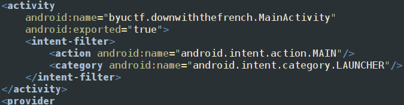
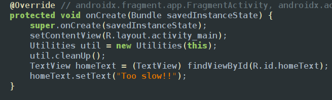
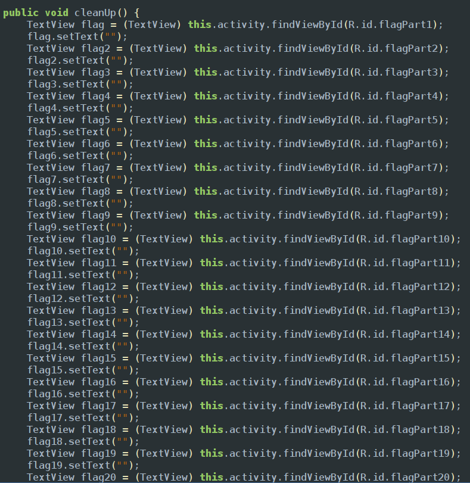
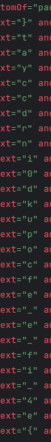

Inspected androif manifest there is a main activity and service provider which is running in the background and a broadcast receiver in which the broadcast receiver class and main activity are exported as true

In the main activity there is a function called cleanup which called immediatly after the main function is being initiliazed and displays a text too slow 

if we explore the cleanup function we could see 28 different parts of flag which are initially in resources/strings files but later cleaned up by cleanup function 

in order to get to know the initial values you need explore the resource file so i used apktool to convert the apk to folder and later opened it with android studio and found activity_main layout since that is wher the text is being displayed and found the 24 differnet parts of the flag
