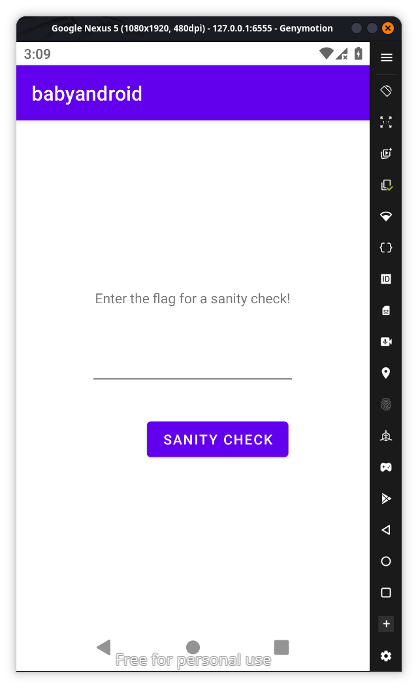
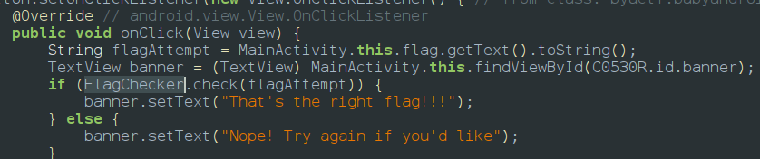
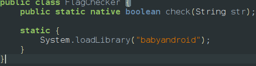
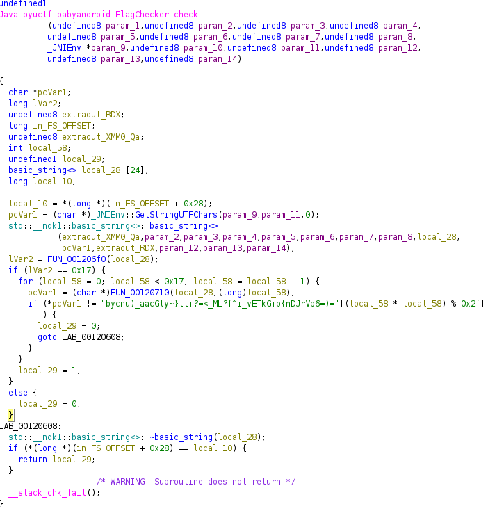

After installing the app we can find out the app is waiting for text 

exploring jadx we find flagchecker function which uses a native lib so we can use ghidra to to reverse it 


and we find the thr function flag checker

we can see that there is a logic that reveals flag so we need to enter something length of 23 character and performs a logic and it checks our input with a hardcoded string so we need to decode it we can use python for the same logic and decode it
```javascript
target = "bycnu)_aacGly~}tt+?=<_ML?f^i_vETkG+b{nDJrVp6=)="
flag = ""

for i in range(23):
    # Calculate the index using the formula from the decompiled code
    index = (i * i) % 47
    flag += target[index]

print(f"The flag is: {flag}")
```
and we get the output as `byuctf{4ndr01d_r3v_1_5}`
<empty-block/>