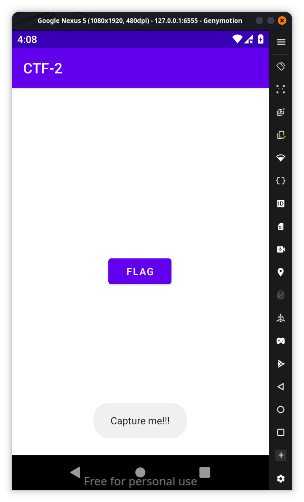
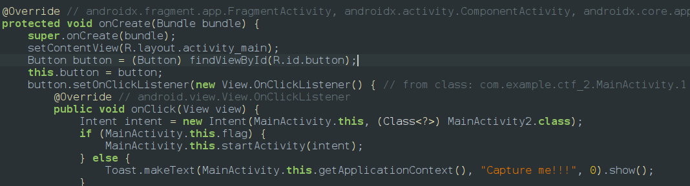
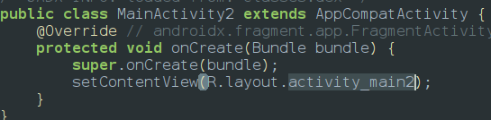
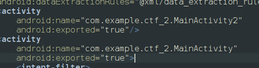
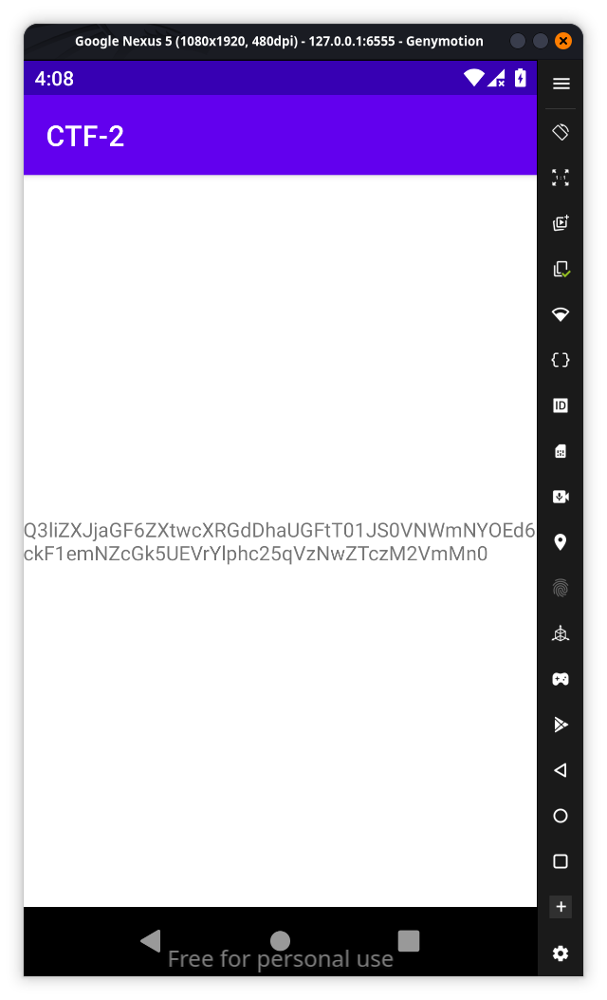

If we look at the app we can find a flag button when we click it returns a toast message

we will further explore the app using jadx before that 
**Description:**
**Join the chase in "Capture Me," where your mission is to uncover and exploit vulnerabilities in mobile apps.**

we could see that after hitting the button it tries to open MainActivity2 

if we think according to description there is a vulnerability so we start looking at AndroidManifest.xml 

so we can start MainActivity2 with adb command `adb shell am start -n com.example.ctf_2/.MainActivity2` and we get a base64 encoded flag which we use [CyberChef](https://gchq.github.io/CyberChef/#recipe=From_Base64('A-Za-z0-9%2B/%3D',true,false)&input=UTNsaVpYSmphR0Y2Wlh0c09XZFNVRGh5YWt4aVVIWjZkakZ0V1ROV2RWRTJUWE5TVWpZelpVeHFaRE40YkU1M2JWUXlObkV4T1hoWk1HZDRTbjA) to decode the base64 string `Q3liZXJjaGF6ZXtwcXRGdDhaUGFtT01JS0VNWmNYOEd6ckF1emNZcGk5UEVrYlphc25qVzNwZTczM2VmMn0`

so the flag is `Cyberchaze{pqtFt8ZPamOMIKEMZcX8GzrAuzcYpi9PEkbZasnjW3pe733ef2}`
<empty-block/>