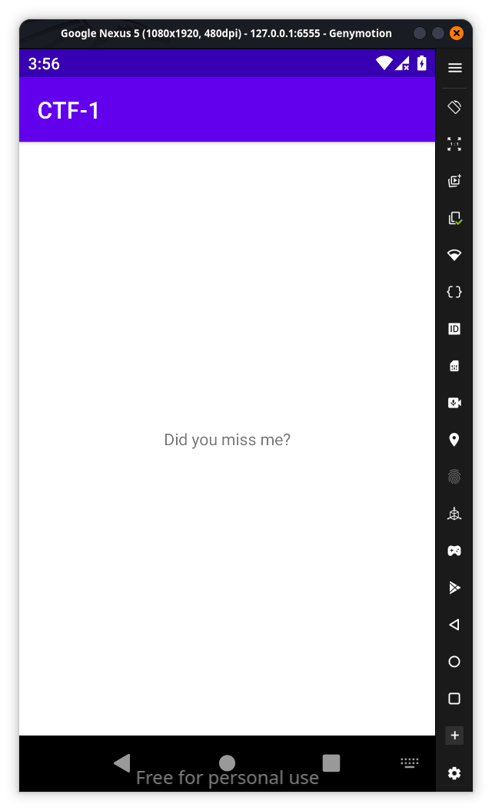
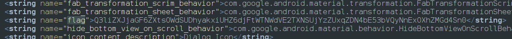

If we install the app it looks like nothing useful

**Description:**
**Just like the Joker’s return to Gotham, this mobile app has a hidden surprise waiting for you. Unearth the hardcoded flag tucked away in the shadows and show us that you’ve missed the thrill of the chase!**
So as the challenge says the flag is hardcoded so our first approach is string.xml because most of them will be there and found flag 

it is basically base64 `Q3liZXJjaGF6ZXtsOWdSUDhyakxiUHZ6djFtWTNWdVE2TXNSUjYzZUxqZDN4bE53bVQyNnExOXhZMGd4Sn0 `so using  [CyberChef](https://gchq.github.io/CyberChef/#recipe=From_Base64('A-Za-z0-9%2B/%3D',true,false)&input=UTNsaVpYSmphR0Y2Wlh0c09XZFNVRGh5YWt4aVVIWjZkakZ0V1ROV2RWRTJUWE5TVWpZelpVeHFaRE40YkU1M2JWUXlObkV4T1hoWk1HZDRTbjA) we will decode it and we get the flag
`Cyberchaze{l9gRP8rjLbPvzv1mY3VuQ6MsRR63eLjd3xlNwmT26q19xY0gxJ}`
