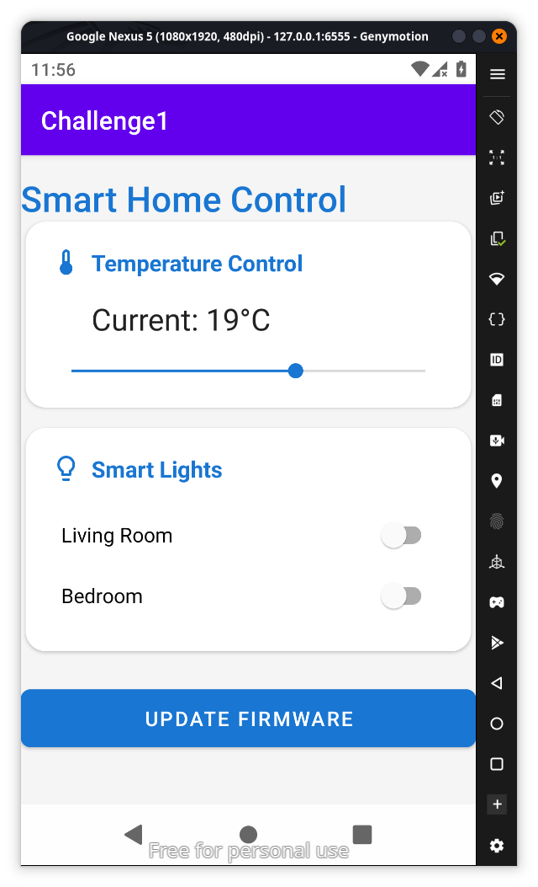
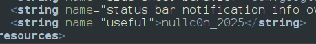
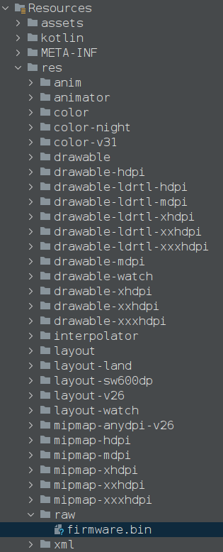
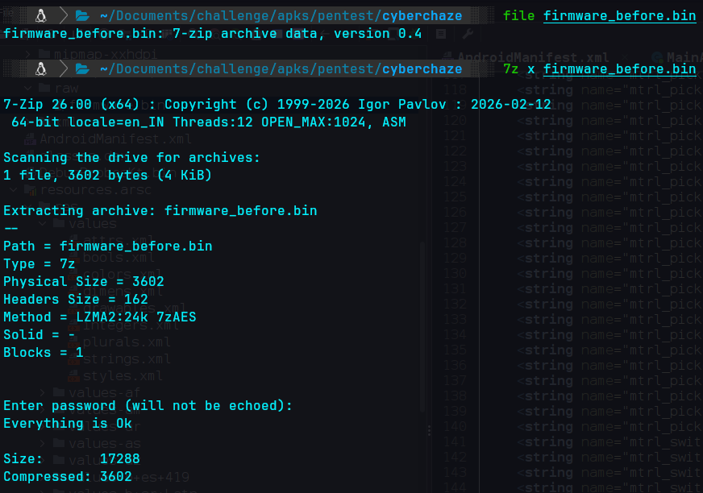
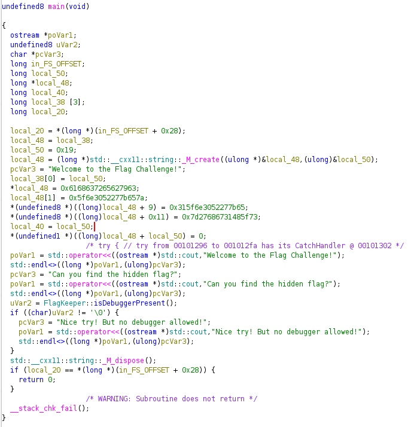
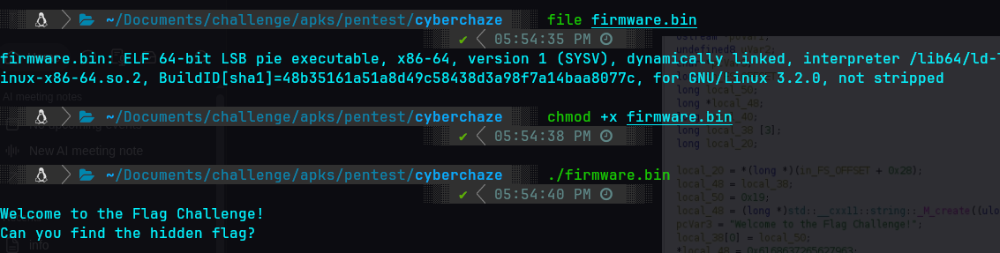
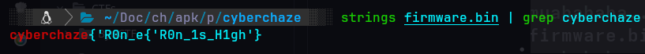

**Description:**
**Within a plain mobile firmware update, a secret quietly lies hidden. Overlapping memory writes whisper hints of a concealed message—if you're willing to look beyond the surface.**
lets install the app and look it we might find something useful

hmm nothing useful which we can confirm after looking jadx what does this button do
since its a concealed message my first approach was going through strings.xml which would be under the folder resources.arc/res/values/strings.xml and we found something useful 

this might be useful somewhere
the description says a secret lies in frimware update so the apk should contain the firmware updates file some where googling we will find
In JADX, firmware updates (or OTA update files) included within an APK are typically stored in the assets/ directory, or sometimes within the res/raw/** **directory if they are treated as raw resources.
If the firmware is not directly stored in the APK but downloaded at runtime, the update file itself will not be in JADX, but the logic to download it can be found in the sources/ Java code

and as our search results said we found the file we will export it and try to open it and 

I have renamed the bin file so i wouldnt get confused as frimware_before.bin                                 
it is a 7zip file and we can unxip using the commadn `7z x firmware_before.bin` and found its protected we got something useful before in jadx `nullc0n_2025` which is the password and it produces another file the unzipped version lets check it out
There are many ways to solve this since its a .bin file we can use ghidra to view the code 

so we can also see we cant use gdb here it detects and returns nothing so we try running our file making it executable

from the above ghidra we hexbytes we will get 
constants assigned to `local_48`:
### Part 1: `0x6168637265627963`
- **Hex Bytes:** `63 79 62 65 72 63 68 61`
- **ASCII:** `c y b e r c h a`
### Part 2: `0x5f6e3052277b657a`
- **Hex Bytes:** `7a 65 7b 27 52 30 6e 5f`
- **ASCII:** `z e { ' R 0 n _`
### Part 3: `0x315f6e3052277b65` (Offset by 9)
This part overlaps with the previous assignment. Note the `+ 9` in `(long)local_48 + 9`. This suggests a specific alignment or a change in the string content. Let's look at the final block.
### Part 4: `0x7d27686731485f73` (Offset by 0x11)
- **Hex Bytes:** `73 5f 48 31 67 68 27 7d`
- **ASCII:** `s _ H 1 g h ' }`
so the flag is **`cyberchaze{'R0n_n0_1s_H1gh'}`**
also there is another method we could run strings on the bin file since our function is already has been run the progarm should apply all the logic and should sit idle and since we know the flag starts with cyberchaze

and we got the flag **`cyberchaze{'R0n_n0_1s_H1gh'}`**