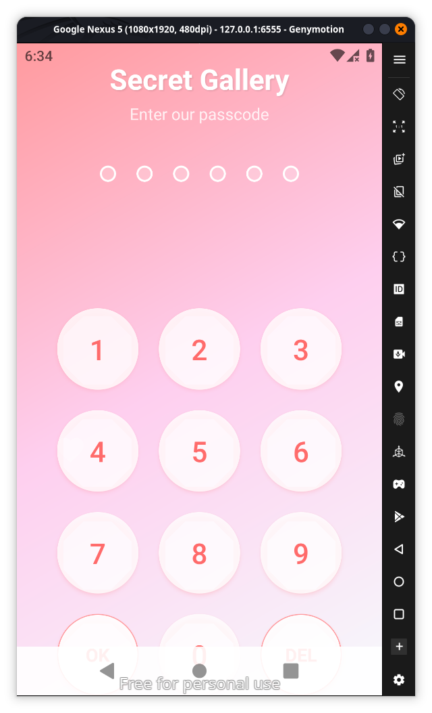
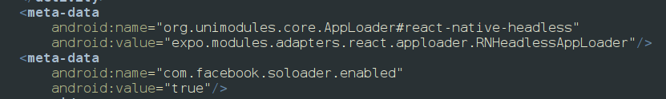
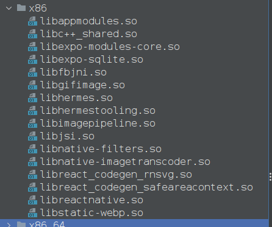
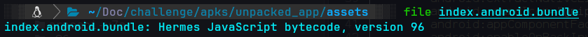
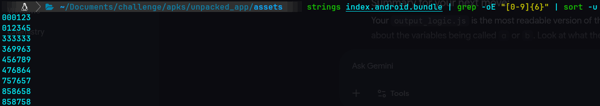
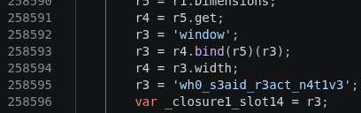
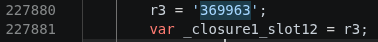
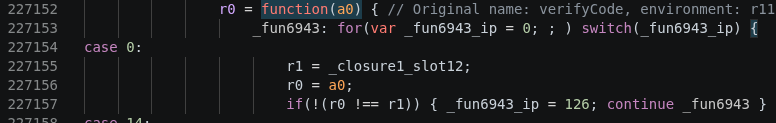

When we install the app we can find it asking for a password which is integers and length of 6 

and if we look at jadx in android manifest in jadx we can find out its a reactive-native app which means we can make apps using react.js and html which was developed by meta company so instagram and facebook use these

also we can confirm by looking at native libraries in the lib folder which has libreactnative.so

so jadx doesnt work here we should you react native decompiler and the java script logic will be mostly in a single file which would be in assets folder after decompiling it with apktool if you look at the file type its a hermes js bytecode so we have to use hermes decompiler  so we install using the command `pip install hermes-dec --break-system-packages`  

after installation there are many tools in hermse-dec so the difference is
<table header-row="true">
<tr>
<td>Tool</td>
<td>What it does</td>
<td>Output quality</td>
</tr>
<tr>
<td>`hbc-disassembler`</td>
<td>Converts to **assembly-like** code</td>
<td>Low level, hard to read</td>
</tr>
<tr>
<td>`hbc-decompiler`</td>
<td>Converts to **pseudo JavaScript**</td>
<td>Readable, preserves strings</td>
</tr>
</table>
So when you ran `hermes-dec` earlier and got `output_logic.js`, you likely used **`hbc-disassembler`** which produced that hard-to-read output where strings were replaced with placeholders like `tmp`, `closure_`, `arg0`.
**`hbc-decompiler`** goes one step further — it reconstructs proper JavaScript with:
- ✅ String literals preserved (`r3 = '369963'`)
- ✅ Function names preserved (`verifyCode`)
- ✅ Readable register-based JS (`r0`, `r1` etc.)
so the right command is `hbc-decompiler index.android.bundle output.js ` so there will a output.js file 
since we know the password is 6 digits from 0-9 we use a command` strings index.android.bundle | grep -oE "[0-9]{6}" | sort -u`  and so we will get the output of all 6 digit integers

after trying each one i found out that the correct string is 369963 and we enter the password in the app and finally photos arrive and after checking each photos we get a part of the flag

and if we look deeper into output.js file we can find out that teh second part of the flag is 

also we can find out the apps login logic in the output.js file 

so these are the parts of the code entry logic and the final flag after attach both parts is
`esch{wh0_s3aid_r3act_n4t1v3_1s_s3cure?_k3y_w4s_369963}`
<empty-block/>
<empty-block/>