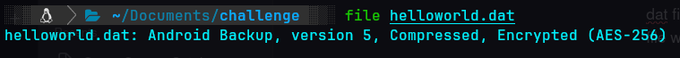
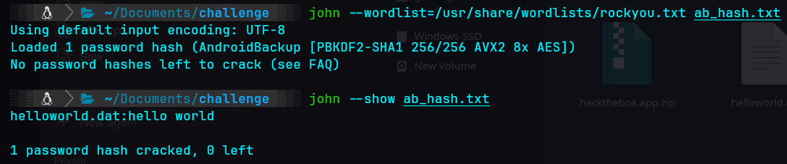
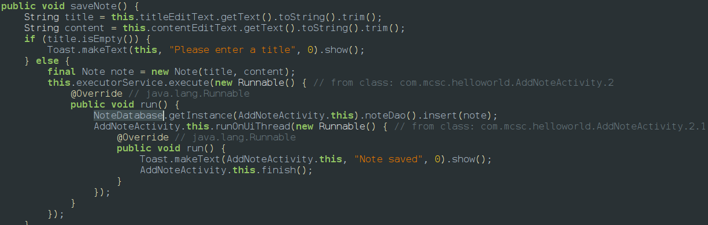
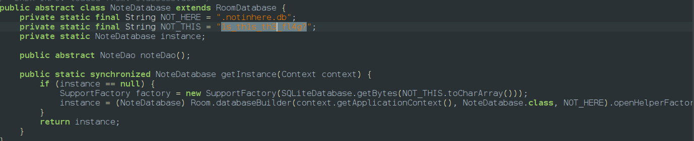

dat files are used to store any kind of files they are called data files so to kneo th eorigina type of file we will run the file command `file HelloWorld.dat`

we can see that its a android backup file which is provided by adb and it compressed and protected with a password of type aes-256 
so first we have to crack the password which can be done by john he ripper

so the password is hello world and we open the dat file using the command `java -jar ~/Downloads/abe.jar unpack helloworld.dat helloworld.tar 'hello world’`
we have to downoad abe jar from the github because ab files can be only changed using it some we name it helloworld.tar then we unpack the tar file to get what we needed and then we find multiple folders and we fina a base.apk in one of the folder 
Once you open the app its a note manager app so if we look at jadxcode in addnote activity

we can see that its adding to a NoteDataBase and if we go to the file to view the code we can find that the db its is storing is .notinhere.db which is protected and the key is 1s_th1s_th3_fl4g which we could find out when accessing the db it isnt acting like normal db which can be accessed by sqlite so we have to use sql cipher
