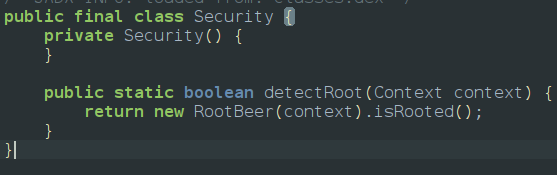
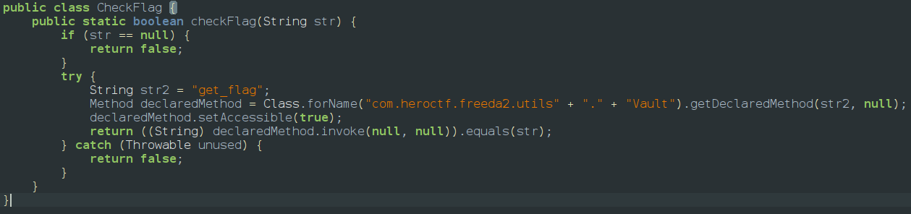
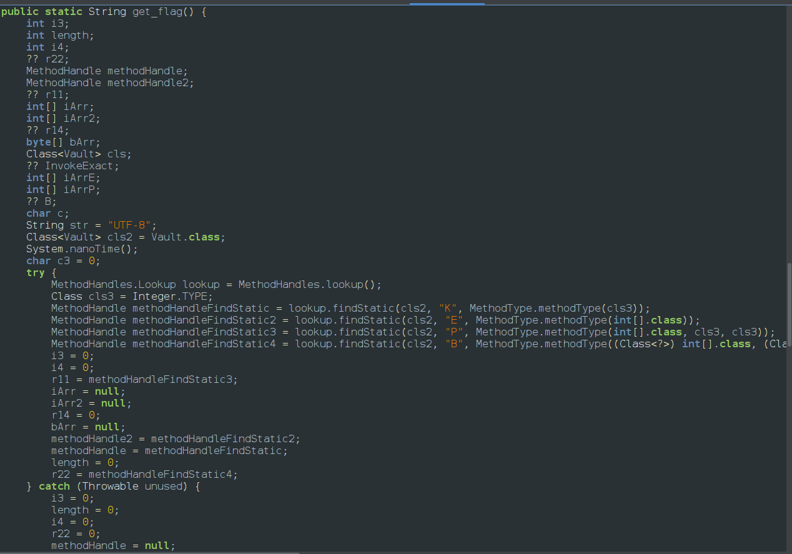
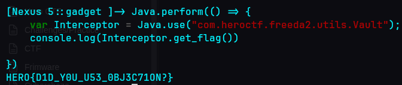

<span color="blue">**Description:**</span>
<span color="blue">**Try to find the password to open this vault!**</span>
<span color="blue">**I was told that it was dangerous to let my application install on a rooted machine. I fixed the problem!**</span>
<span color="blue">**Don't waste too much time statically analyzing the application; there are much faster ways.**</span>
<empty-block/>
This clearly says the application wont work on rooted devices and did mention that we have to use frida except in native files so lets explore jadx and we found that there is four main classes
When we try to open the app it stops saying it is a rooted device so there should be a security check where in jadx it its mentioned as root bear detection

so after submitting after our password it loads  check_flag() function 

This dynamically calls the vault class which contains get_flag() function 

the function undergoes several encryptions and makes the final flag harder to read so we have to come to a conclusion that get_flag() function finally prints our flag so we have to hook this function and print its output
Since it has rootbear detection we could simply patch the apk run objection disable root detection and execute our frida script
```javascript
Java.perform(() => {
    var Interceptor = Java.use("com.heroctf.freeda2.utils.Vault");
    console.log(Interceptor.get_flag())
    
})
```
so after running objection android root disable and run our script we get 

HERO\{D1D_Y0U_U53_0BJ3C71ON?\}
<empty-block/>