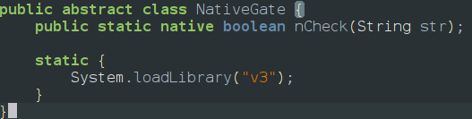
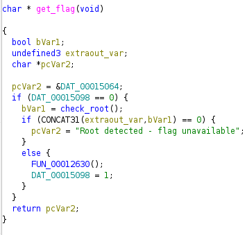
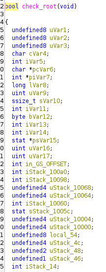
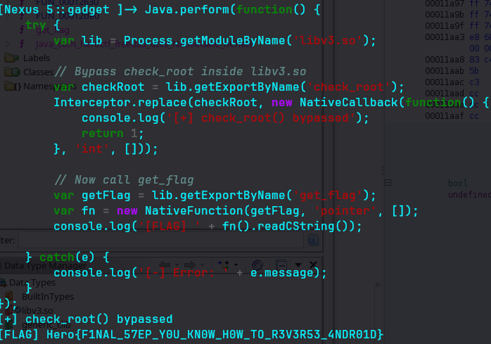

Description:
Try to find the password to open this vault!
I was told that it was dangerous to let my application install on a rooted machine. I fixed the problem!
I was also told that it was safer to move sensitive functions from my code to a native library, so that's what I did!
Don't waste too much time statically analyzing the application; there are much faster ways.

The description says that the application doesnt run on rooted devices and the flag revealing function is in native lib so lets find whats that native library 

so lets load that native file into ghidra and check it out there is a function that has getglag() 

so it has a root checker called check_root() function and if we can see its loading a pointer value to pcVar2 and finally returning that if everything is fine 
Also it is initialized even before check_root() function is called 

we could see that the check_root() is a boolean function so our goal is to bypass check_root() and print the return value of the function so the frida script is 
```javascript
Java.perform(function() {
    var lib = Process.getModuleByName('libv3.so');

    // return 1 (non-zero) to pass the check
    var checkRoot = lib.getExportByName('check_root');
    Interceptor.replace(checkRoot, new NativeCallback(function() {
        console.log('[+] check_root() bypassed → returning 1');
        return 1;
    }, 'int', []));

    // now get_flag() will return the real flag string
    var getFlag = lib.getExportByName('get_flag');
    var fn = new NativeFunction(getFlag, 'pointer', []);
    console.log('[FLAG] ' + fn().readCString());
});
```
so when i tried it still failed so i patched the apk with objection and used android root disable and tried again still failed since the the function is called under oncreate method so we have to submit something as password or the native library files will not load in the app
we can either paste it in a seperate file or paste it in frida repl so after running it we get the output as

so the flag is Hero\{F1NAL_57EP_Y0U_KN0W_H0W_TO_R3V3R53_4NDR01D\}