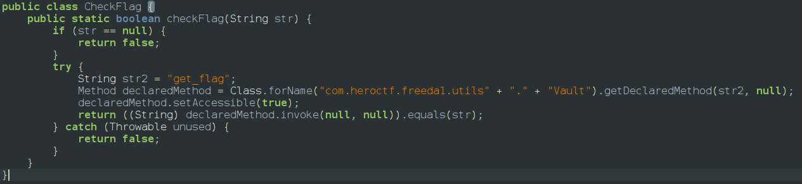
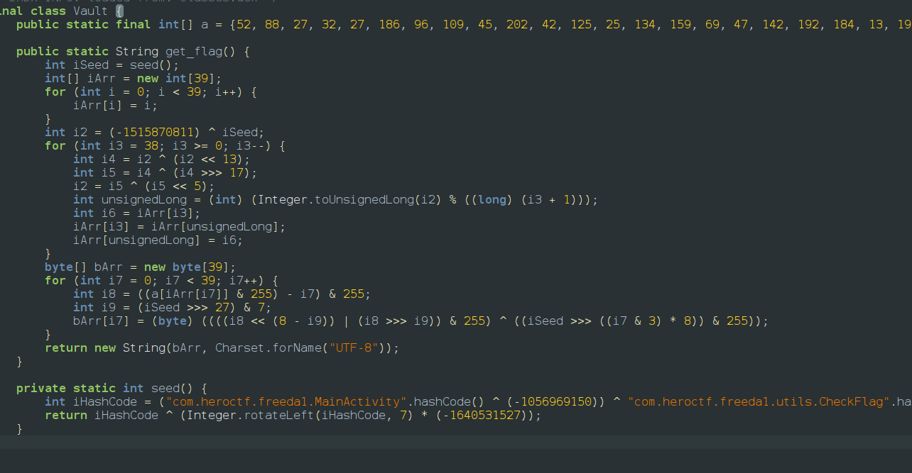
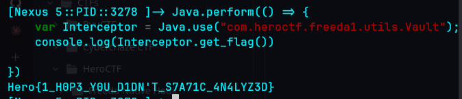

<span underline="true">***Description:***</span>
<span underline="true">***Try to find the password to open this vault!***</span>
<span underline="true">***Don't waste too much time statically analyzing the application; there are much faster ways.***</span>
<empty-block/>
So there is no root detection to this app so it opens normally we go to jadx to explore the code and we find check_flag class and vault class 
 

There is nothing such as password we can find the flag when submit button is clicked it calls check flag function which dynamically loads get_flag function flag in vault class 

so using frida we have to intercept the function and get the output of get_flag() function and the script is 
```javascript
Java.perform(() => {
    var Interceptor = Java.use("com.heroctf.freeda1.utils.Vault");
    console.log(Interceptor.get_flag())
    
})
```
and we get the output

Hero\{1_H0P3_Y0U_D1DN'T_S7A71C_4N4LYZ3D\}