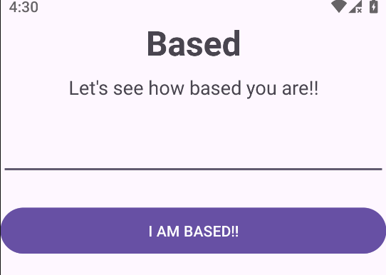
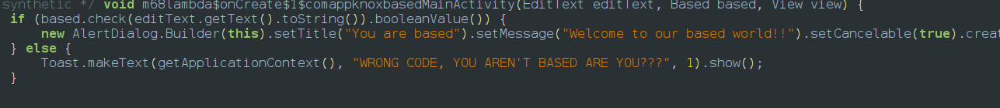
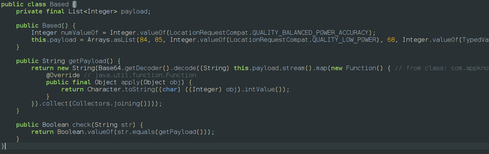

When we install the app we will be granted with the screen




so lets go to jadx and after going to main activity we find a success logic at the end of the code



so we go to the check function and we will find a based class



so what happens here is the getpayload() method takes the array values convert them into ascii which results **`TUhDezU1X1kwkwVV9UMDBfNFIzXzRfQjQ1M0RfNTBOfQ==`****  **which is a base64 string and after decoding it we get the flag **`MHC{50_8wU_00_4R3_4_B453D_50N}`**
The python script which i used is 
```python
import base64

# Mapping the integers from the Based class
payload = [
    84, 85, 104, 68, 101, 122, 85, 49, 88, 92, 119, 85, 85, 
    57, 85, 77, 68, 66, 102, 78, 70, 73, 122, 88, 122, 82, 
    102, 81, 106, 81, 49, 77, 48, 82, 102, 85, 68, 78, 83, 
    78, 84, 66, 79, 102, 81, 61, 61
]

# Convert ints to characters and join
b64_str = "".join([chr(b) for b in payload])

# Decode
flag = base64.b64decode(b64_str).decode('utf-8')
print(flag)
```
<empty-block/>
