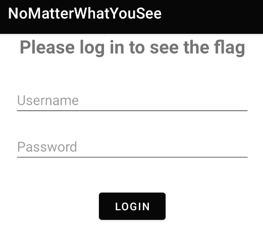
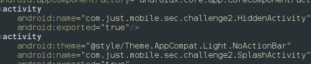
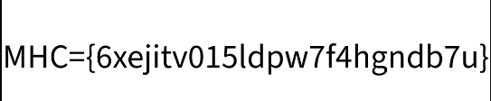

When we install the app we will be prompted with the screen 

After analyzing jadx we will find some classes where we couldnt find any logic so we start analyzing android mainfest line to line and we found

some of them look suspicious and are exported as true its a worth a short to try to start them so use the command to start the hidden activity 
`adb shell am start -n com.just.mobile.sec.challenge2/.HiddenActivity`

<empty-block/>