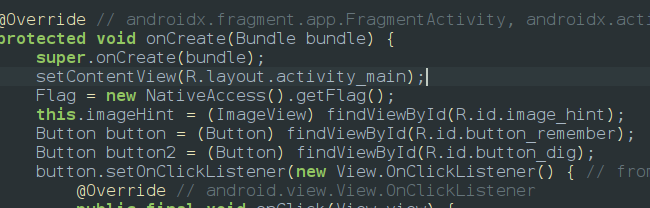
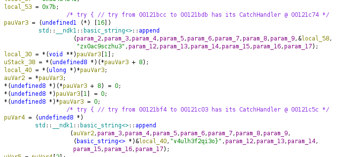

Starting with jadx we can see that there is a flag function which uses 

so we switch to ghidra to analyze the code

the hardcoded strings are being appended to intial reverse local 57,53 which results the flag **`MHC{zx0ac9sczhu3v4ulh3f2qi3o}`**
