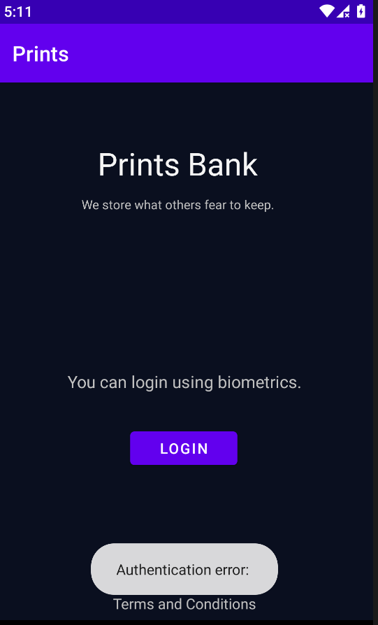
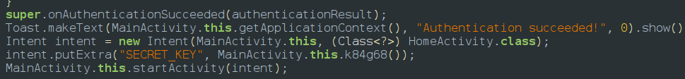
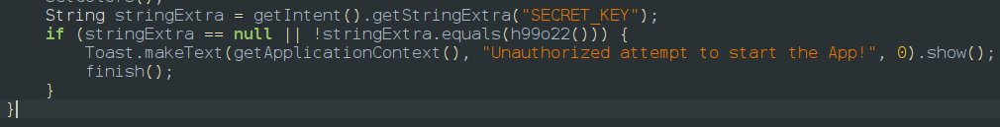

After opening the app we will be provided with the screen and when we click login we get the authentication error message

so we go to jadx and analyse it and we can find if the authentication is a success in main activity it sends an intent with a label SECRET_KEY to home activity which contains the return value of a native function 

The home activity takes the function and comapares it with the return value of another native function 

so lets actually understand how the app flow works
**The App's Flow (from jadx):**
tap
 LOGIN → biometricPrompt.authenticate() → onAuthenticationSucceeded() → 
time check → start HomeActivity with SECRET_KEY → signature check → 
SECRET_KEY check → show flag
---
**Script 1 — universal-biometric.js **
The script is cloned from  [Frida CodeShare](https://codeshare.frida.re/@ax/universal-android-biometric-bypass/) 
What
 it does: Hooks BiometricPrompt.authenticate() at the native Android 
level and immediately calls onAuthenticationSucceeded() without waiting 
for a real fingerprint.
Why
 we need it: The app uses androidx.biometric.BiometricPrompt to 
authenticate. On a real device with fingerprint enrolled, this script 
intercepts the authenticate call and fakes a successful fingerprint scan
 before the hardware is even involved.
Why
 it didn't fully work on Genymotion: Genymotion has no fingerprint 
hardware. So before our hook could fire a success, Android itself threw 
error code 12 (BIOMETRIC_ERROR_NO_BIOMETRICS) which went to 
onAuthenticationError — a callback the universal script doesn't hook.
---
**Script 2 — Time check bypass**
What it does: Hooks the native method f14e32() and makes it return a huge number.
Why we need it: Inside onAuthenticationSucceeded() the app does this check:
if
 (System.currentTimeMillis() - startTime \> 
Integer.parseInt(f14e32())) \{ Toast.makeText(..., "Wrong 
fingerprint!").show(); return; \}
f14e32()
 returns a time limit in milliseconds. If you take longer than that to 
authenticate, it shows "Wrong fingerprint" and blocks login. By 
returning 999999999 (16 minutes), the check always passes.
Why
 it's obfuscated: The method name f14e32 is meaningless on purpose — the
 developer obfuscated it to make reverse engineering harder. We found it
 by reading the jadx decompiled source.
---
**Script 3 — Signature bypass**
What it does: Hooks isAppSignatureValid() in both activities and forces it to always return true.
Why
 we need it: The app checks its own APK signature using SHA-256. This is
 tamper detection. The hardcoded hash is the signature of the original 
APK. Since we're running it through Frida, the signature won't match and
 the app calls finish() — killing itself. By returning true we tell the 
app "yes this is the original unmodified APK" even though it isn't.
Why
 it's in both activities: MainActivity checks it silently. HomeActivity 
checks it immediately in onCreate and kills itself if it fails — so we 
must bypass both.
---
**Script 4 — Genymotion error intercept**
What
 it does: Hooks onAuthenticationError and instead of letting the error 
propagate, calls onAuthenticationSucceeded with a fake result.
Why
 we need it (Genymotion specific): On Genymotion, there is no 
fingerprint sensor. When the app calls authenticate(), Android 
immediately fires onAuthenticationError with code 12 
(BIOMETRIC_ERROR_NO_BIOMETRICS) before our universal script's hooks even
 get a chance to fake a success. This script catches that error and 
converts it into a success.
Why .new(null,0)not.new(null,0)not.new(null,
 null, 0): The AuthenticationResult constructor on this version of 
AndroidX only takes 2 arguments (CryptoObject, int) not 3. We pass null 
for the CryptoObject (no crypto needed) and 0 for the authenticator 
type.
---
**Summary:**
Script
 1 — universal-biometric.js — Bypasses fingerprint hardware check — 
Needed on real device: YES — Needed on Genymotion: PARTIAL
Script 2 — Time check — Bypasses f14e32() time limit — Needed on real device: YES — Needed on Genymotion: YES
Script 3 — Signature bypass — Bypasses isAppSignatureValid() — Needed on real device: YES — Needed on Genymotion: YES
Script 4 — Error intercept — Bypasses Genymotion no-hardware error — Needed on real device: NO — Needed on Genymotion: YES