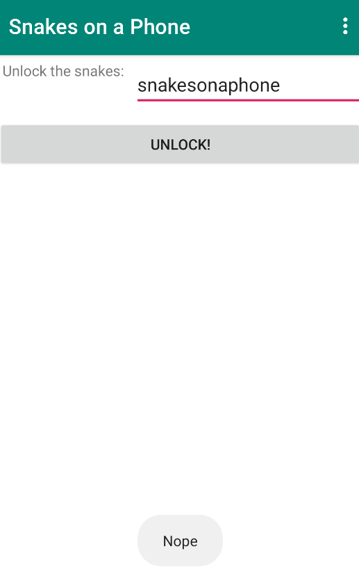
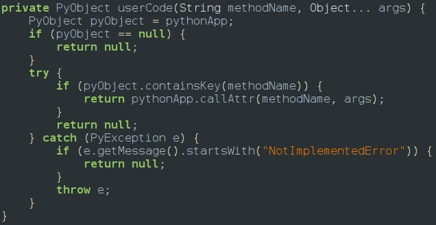
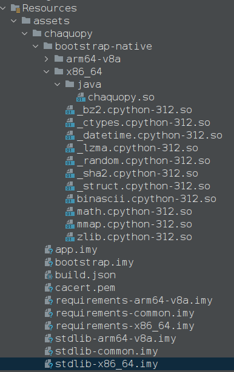
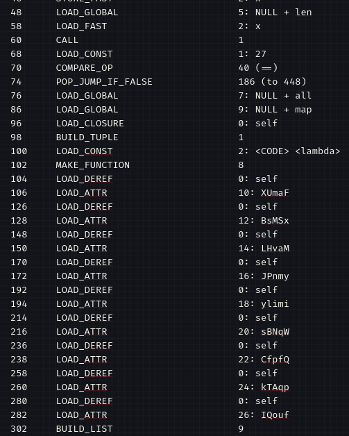

So we install the apk on our emulator and we will be provided with this screen waiting for an input so lets go to jadx and analyze the decompiled code



So after analyzing jadx we have to come to a conclusion that the app logic is coded in python and the code is loaded dynamically to the classes as we can see there are multiple python references and this makes the challenge name acceptable **`snakes = python`****  **so this can be achieved by using



From java code we can confirm that it uses Chaquopy which can be found in Resourcces/assests

> Chaquopy is an SDK that allows developers to run Python code inside Android applications by bridging the gap between Python and the native Java/Kotlin environment. It integrates directly with Android Studio, enabling the use of Python's extensive libraries and logic while maintaining full access to the standard Android framework and APIs.



since these are imy files which are zip folders for byte code of python and app.imy is worth for decompiling since it contains core app logic so we unzip the imy file and we will find app.pyc file which is decompiled byte code version of python
so i chose  [https://github.com/zrax/pycdc.git](https://github.com/zrax/pycdc.git) for decompiling the bytecode of python so the command goes as             **`pycdas app.pyc > app.py`** or **`pycdas app.pyc > app.txt`**** **
after using the command we found out the chall was using Python 3.12 which that pycdc isnt yet supported so we can generate the disassembled python txt file which actual mimic the code which can sufficient enough to solve this chall 
The bytecode for the `unlock` method shows a length check against the user's input:
```ascii art
478     LOAD_METHOD              13 (len)
481     LOAD_CONST               10 (27)
482     COMPARE_OP               2 (==)
```
**Finding:** The flag length must be exactly **27 characters**.
### The Chunking Mechanism
The input is split into 9 chunks, each containing 3 characters. These chunks are processed by 9 distinct mathematical functions.
- **Functions identified:** `XUmaF`, `BsMSx`, `LHvaM`, `JPnmy`, `ylimi`, `sBNqW`, `CfpfQ`, `kTAqp`, and `IQouf`.

So there are 9 functions so i am going to share a few but i provided a detail explanation in below table
Segment 1 (`XUmaF`) Bytecode
```ascii art
625     LOAD_CONST               1 (82)
626     LOAD_CONST               2 (5)
627     LOAD_FAST                0 (x)
628     BINARY_OP                5 (*)
629     BINARY_OP                10 (-)
```
**Equation:** \$f(x) = 82 - 5x\$
**Calculation:**
• \$f(1) = 77\$ (`M`)
• \$f(2) = 72\$ (`H`)
• \$f(3) = 67\$ (`C`)
**Result:** `MHC`
Segment 4 (`JPnmy`) Bytecode
```ascii art
583     LOAD_CONST               1 (5.5)
584     LOAD_FAST                0 (x)
585     LOAD_CONST               2 (2)
586     BINARY_OP                8 (**)   # Power of 2
587     BINARY_OP                5 (*)    # Multiplied by 5.5
```
**Equation:** \$f(x) = 5.5x\^2 - 18.5x + 110\$**Result:** `a_h`

| **Segment** | **Function** | **Logic (Solved)** | **Output** |
| --- | --- | --- | --- |
| 1 | `XUmaF` | $`82 - 5x`$ | `MHC` |
| 2 | `BsMSx` | $`-2x^2 - 11x + 136`$ | `{jU` |
| 3 | `LHvaM` | $`-42x^2 + 189x - 94`$ | `5t_` |
| 4 | `JPnmy` | $`5.5x^2 - 18.5x + 110`$ | `a_h` |
| 5 | `ylimi` | $`-33.5x^2 + 162.5x - 77`$ | `4rm` |
| 6 | `sBNqW` | $`-36.5x^2 + 134.5x - 22`$ | `Le5` |
| 7 | `CfpfQ` | $`-12.5x^2 + 79.5x - 14`$ | `5_p` |
| 8 | `kTAqp` | $`-19.5x^2 + 85.5x + 23`$ | `Yth` |
| 9 | `IQouf` | $`-23.5x^2 + 132.5x - 61`$ | `0n}` |

so the final flag is **`MHC{jU5t_a_h4rmLe55_pYth0n}`**
