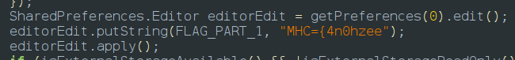
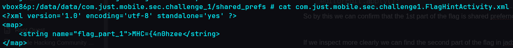
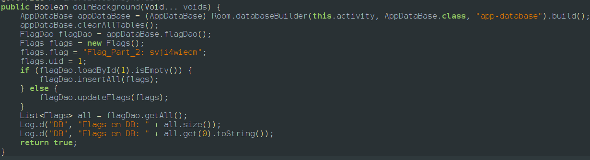
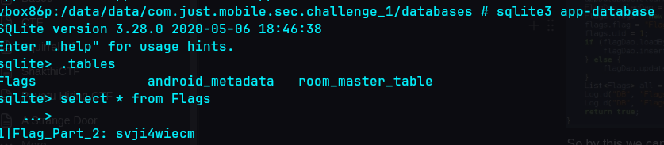
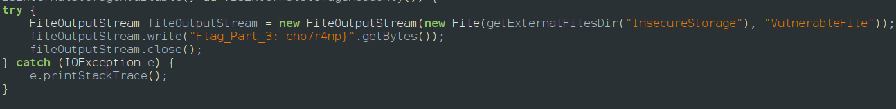
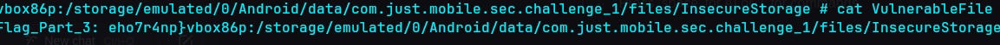

> Description:A vulnerable app stores sensitive data using insecure methods. Can you uncover where they’re hidden and retrieve them all?

After we install an app we get a text message as the flag is stored as 3 parts so if we go to jadx we can find the first part of the flag

So by this we can confirm that the 1st part of the flag is shared prefernces

If we inspect more clearly we can find the second part of the flag in jadx also

So by this we can confirm that the second part of the flag is in the database

If we inspect more in jadx we found the 3rd part of the flag in jadx 

so by this we can say its in a external file called Vulnerablefile in InsecureStorage fodler

so the flag is **`MHC{4n0hzeesvji4wiecmeho7r4np}`**
