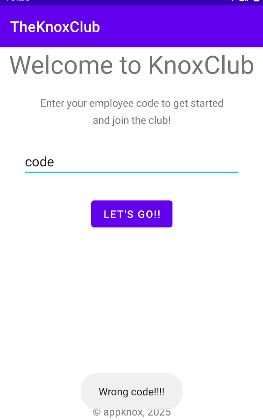
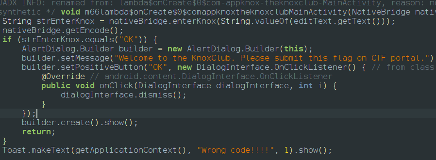
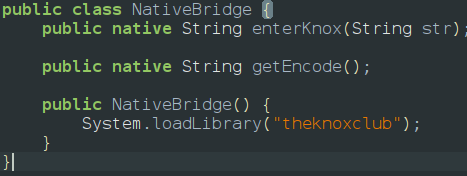
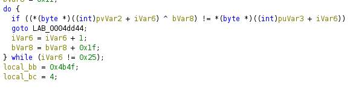

> Descrption:A mysterious Android app from the secretive KnoxClub claims only true insiders can get past the velvet rope. One screen. One input. Somewhere within, a guarded message proves you belong. No external services just you, the APK, and whatever you can uncover.

When we install the app we will be prompted with a text field 



So now lets go to jadx and explore it and we can see that it checks our input with a native function





so we switch to ghidra and we will find 2 function getencode and enterknox functions which are worth for exploring



so in the get_encode function we can find its taking our input and performing a xoring operation with a key The key isn't static. It starts at `0x11` and increases by `0x1f` for every single character and comparing it with a hardcoded hex value and if it matches every single byte matches after the XOR, it sets a status variable to `0x4b4f` (ASCII for **"OK"**). so i wrote a python script which implement same operation since xoring can be reversed

```python
# Extracted bytes from the puVar3 assignments
target = [
    0x5C, 0x78, 0x0C, 0x15, 0xB8, 0x9C, 0x94, 0xB3, 
    0x46, 0x7D, 0x18, 0x2D, 0xEB, 0x94, 0xB4, 0xBD, 
    0x55, 0x10, 0x60, 0x2B, 0x48, 0xAF, 0xE4, 0x9C, 
    0xAB, 0x29, 0x53, 0x62, 0x2A, 0xA0, 0x86, 0x8D, 
    0xA6, 0x23, 0x63, 0x02, 0x10
]

key = 0x11
flag = ""

for byte in target:
    flag += chr(byte ^ key)
    key = (key + 0x1f) & 0xFF  # Keep it within 8-bit range

print(f"Flag: {flag}")
```

so the flag is **`MHC{50_YOU_Kn0w_T0_u53_FR1d4_45_W3LL}`**
so the challenger thought we might use frida so lets obtain using it too so the frida script is 
```javascript
Java.perform(function () {
  var env = Java.vm.getEnv();

  function jstr(p) { return env.getStringUtfChars(p, Memory.alloc(1)).readCString(); }

  ["enterKnox", "getEncode"].forEach(function (name) {
    var addr = Module.findExportByName("libtheknoxclub.so",
      "Java_com_appknox_theknoxclub_NativeBridge_" + name);
    Interceptor.attach(addr, {
      onEnter: function (a) { if (name === "enterKnox") console.log("[>] input:", jstr(a[2])); },
      onLeave: function (r) { console.log("[<]", name, jstr(r)); }
    });
  });
});
```
