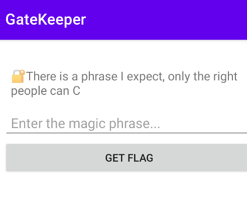
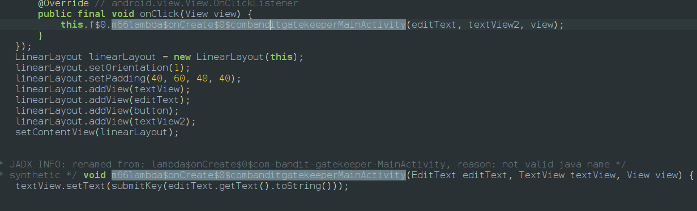
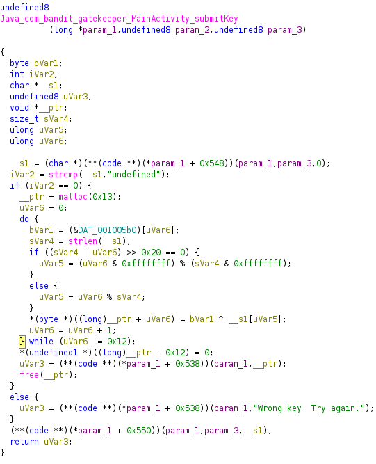
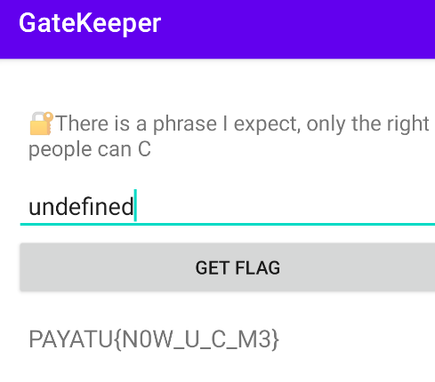

After installing the app we can find that the app is waiting for a input

the app reveals a hint only right people can C. C language will be only used in native files
we go to jadx to analyze the code and found out we have a native file to check the password and reveal the flag so we use ghidra 

the password is hardcoded as undefined so we enter the same in app input

so after giving input we get the flag 

`PAYATU{NOW_U_C_M3}`
<empty-block/>