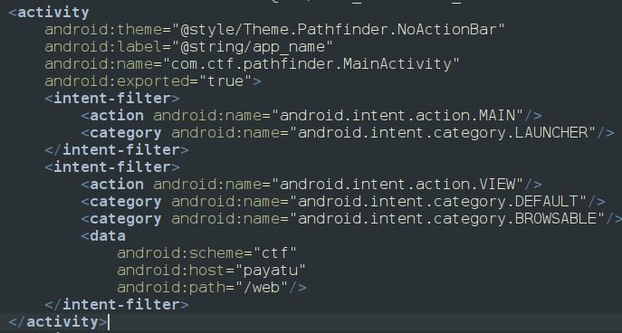
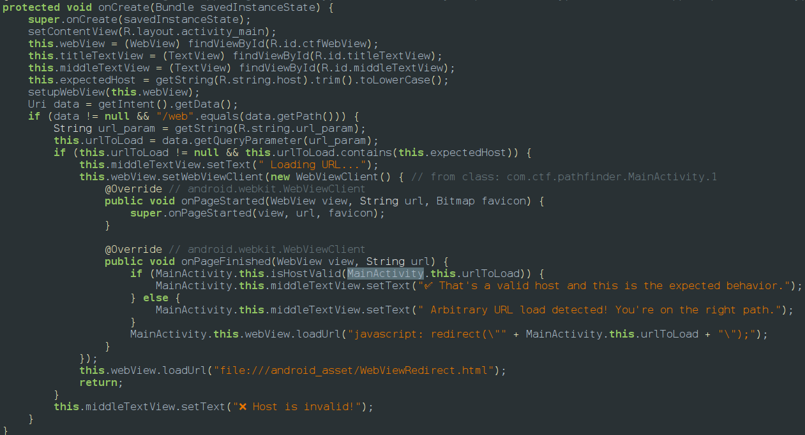
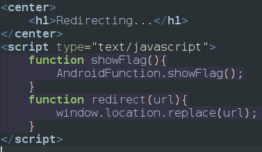
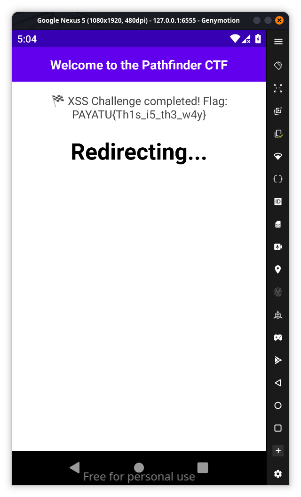

When we open the app it says you are ooking in the wrong screen so we go to android manifest and we find out its waiting for a url so mainactivity it selfs is waiting for a deeplink 

so we get the main part required for url and if we go deep into the main activity we can find its a webview challenge so 

if you look at the logic to pass the first check we need to expected host and url_param string which is in strings.xml file so which are 
- R.sting.host = payatu.com
- R.string.url_param = url
and the data that we pass through intent should be ni;; iits should be /web and if eveything goes fine it will open the url we passed through adb and parllely open another html file which is `file:///android_asset/WebViewRedirect.html`  so if we inspect that

so the url we pass will redirect to the redirect function but there is a function showflag() which reveals the flag so we have to call the show flag in oder to get flag according to above conditions the url is `ctf://payatu/web?url=javascript:AndroidFunction.showFlag()//payatu.com` 
so the adb command will be 
`adb shell am start -a android.intent.action.VIEW -d "ctf://payatu/web?url=javascript:AndroidFunction.showFlag\(\)`[`//payatu.com`](https://payatu.com/)`" `
