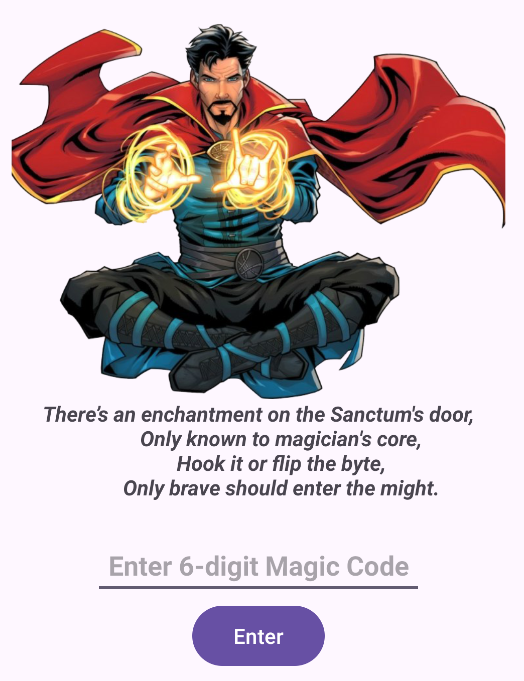
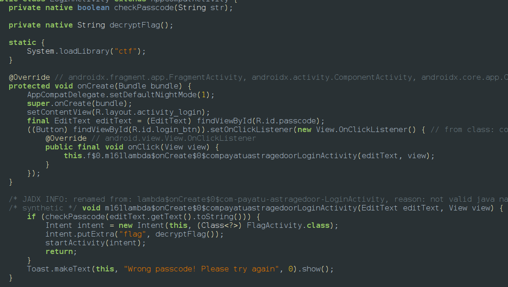
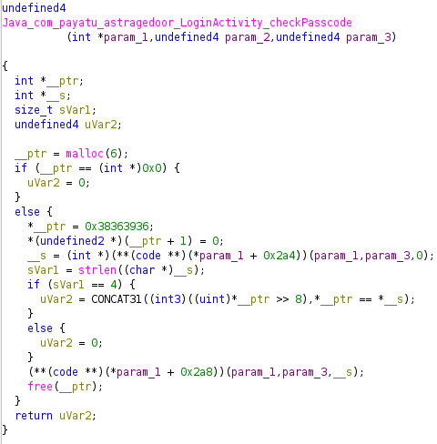
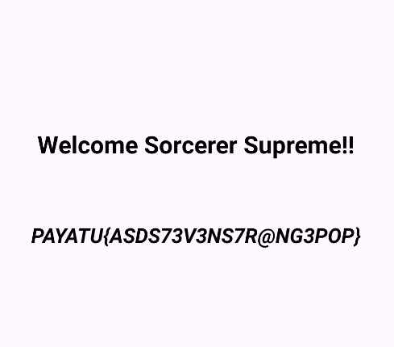
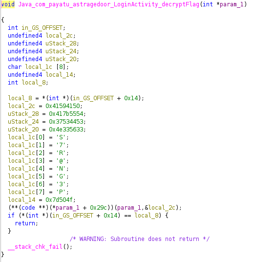

So after installing the app we will be provided with this string so we it provided 2 methods to get the use frida hook or flip the bit (might be this is how the password is being decrypted)
<empty-block/>

<empty-block/>
so lets go to jadx and we can notice its calling 2 native functions decryotflag() and checkPasscode() from the native file ctf

<empty-block/>
so lets go to ghidra and analyze both the functions so  

<empty-block/>
### The Passcode Storage
The code allocates 6 bytes for __ptr and then assigns a hex value to it:
__ptr = 0x38363936;
In C, when you store a hexadecimal value into a memory address, it is stored in Little-Endian format (meaning the least significant byte comes first in memory).
2. Converting Hex to ASCII
To find the actual characters, we break the hex value 0x38363936 into individual bytes and look them up on the ASCII table:
Hex Byte	ASCII Character
0x36	6
0x39	9
0x36	6
0x38	8
<empty-block/>
so probably the challenge tried to mislead us saying its a 6 digit charecter so after we enter 6968 we get the flag

<empty-block/>
also there decryptflag() function its work checking out so 

<empty-block/>

| **Variable** | **Hex Value** | **Reversed (Little-Endian)** | **ASCII Translation** |
| --- | --- | --- | --- |
| **local_2c** | `0x41594150` | `50 41 59 41` | **PAYA** |
| **uStack_28** | `0x417b5554` | `54 55 7b 41` | **TU\{A** |
| **uStack_24** | `0x37534453` | `53 44 53 37` | **SDS7** |
| **uStack_20** | `0x4e335633` | `33 56 33 4e` | **3V3N** |

he next part of the flag is stored character-by-character in `local_1c`. These do not need to be reversed:
- `local_1c[0..7]` = **S7R@NG3P**
### 3. The Final Chunk
Finally, `local_14` contains the trailing bytes:
- **local_14:** `0x7d504f`
- Reversed (Little-Endian): `4f 50 7d`
- ASCII Translation: **OP\}**
---
### The Resulting Flag
Concatenating all these parts together in the order they appear on the stack:
`PAYA` + `TU{A` + `SDS7` + `3V3N` + `S7R@NG3P` + `OP}`
**Final Flag:**
**`PAYATU{ASDS73V3NS7R@NG3POP}`**
###
<empty-block/>