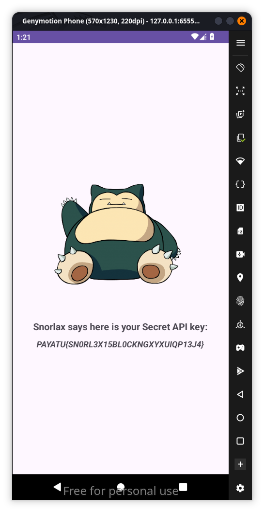

When we install it in a rooted device the app says root device detected and automatically closes so after checking jadx if we just bypass root detection and tap on the sleeping snorlex we could get the flag so why dont we try non rooted device

and yes it works so lets try with rooted device we use objection and install repatched apk and use the commands `objection -n com.payatu.snorlex explore` and after inside objection use `android root disable` and restart the app we get the flag 
`PAYATU{SN0RL3X15BL0CKNGXYXUIQP13J4}`
