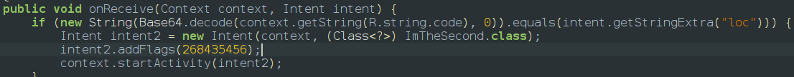
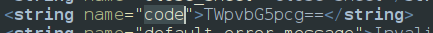
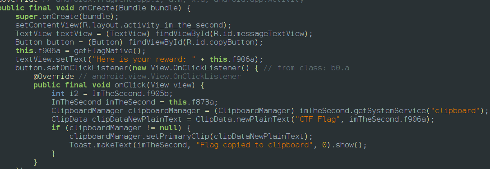

So i tried install the app initially and i couldnt see app launcher in my menu so i explored jadx what might be the possible reason and found out that the AndroidManifest.xml is probably has few missing lines of code which are 
```javascript
<action android:name="android.intent.action.MAIN"/>
<category android:name="android.intent.category.LAUNCHER"/>
```
these are the lines which creates the launcher icon so we have to start the activity using intents and adb commands 
The app can be started by the adb command since main activity is exported as true                                             ` adb shell am start -n com.payatu.whereami/.MainActivity`

After opening the app we could see the app imemdiately starts count down from 7 and suggest us to send a broadcast so using that hint if we look deep into the jadx there is a broadcast listener class 

which receives the broadcast and sends an intent to start iAmTheSecond class which contains the flag revealing code also this broadcast requires 2 strings which of them one of was `loc` and other was in strings so exploring R.Strings.xml class we found out a base64 encoded string which we decoded using cyberchef and found out it was `Mjolnir` 

and the flag revealing code is 

so the command to send the intent is 
`adb shell am broadcast -a com.payatu.whereami.MY_ACTION -n com.payatu.whereami/.BroadCastListener --es "loc" "Mjolnir”`

PAYATU\{WAMI-G0d0F7HUND3RONHUNT\}
<empty-block/>