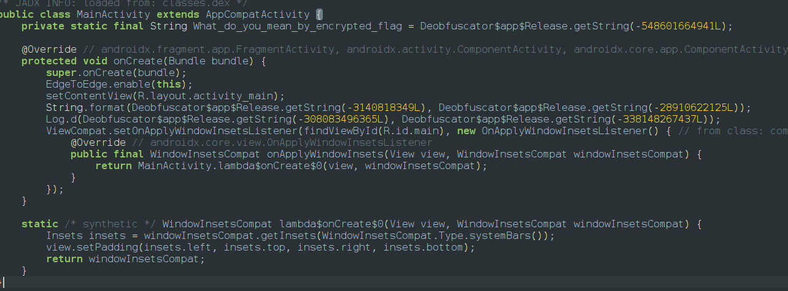
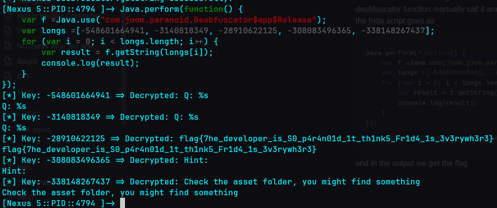

After installing the app and opening the app we will provided with the screen


so there is no button to do so and so function lets go to jadx and analyze the function and we found something sus which we can see **`what_do_you_mean_by_encrypted_flag `**and call a deobfuscator with a long integer



The same function is being called 5 times so one of them must be the flag so we have to hook the deobfuscator function manually call it and pass our values since there is no other way to call it and the frida script goes as

```javascript
Java.perform(function() {
    var f =Java.use("com.joom.paranoid.Deobfuscator$app$Release");
    var longs =[-548601664941, -3140818349, -28910622125, -308083496365, -338148267437];
    for (var i = 0; i < longs.length; i++) {
        var result = f.getString(longs[i]);
        console.log(result);
    }
});
```

and in the output we get the flag **`flag{7he_developer_is_S0_p4r4n01d_1t_th1nk5_Fr1d4_1s_3v3rywh3r3}`**

