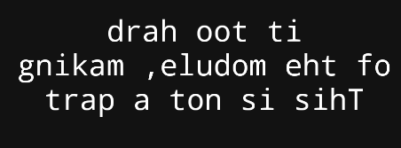
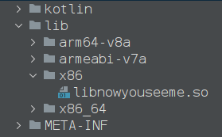
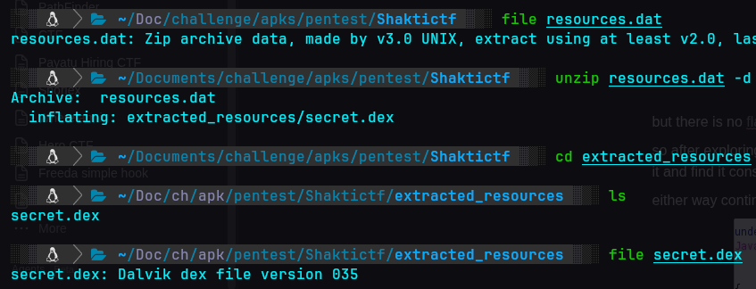
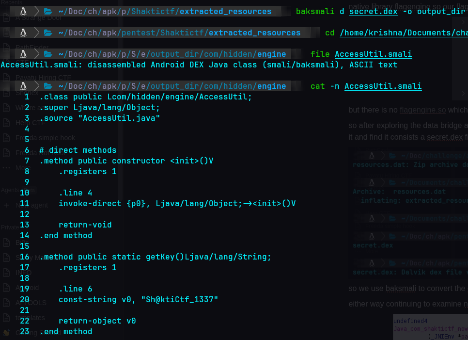
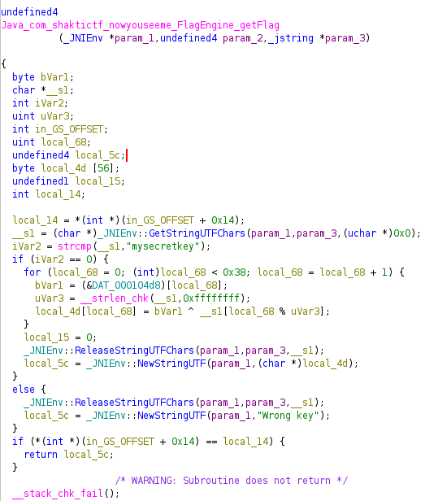
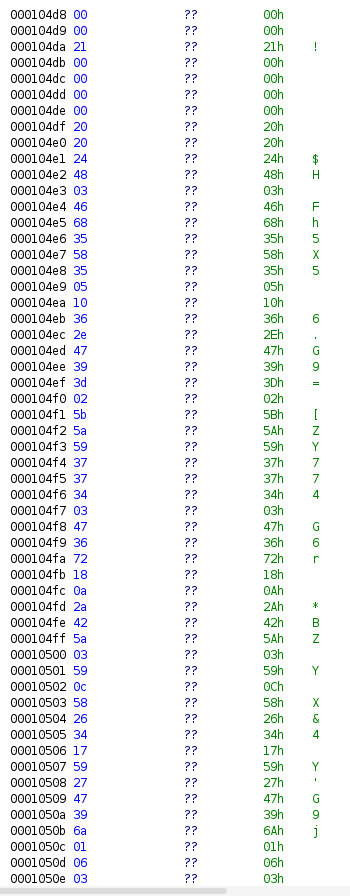

# Nowyouseeme
When we open the app we get to see this weird text and when inspect the code there will be a hint to reverse text which is `This is not a part of the module, making it too hard`

considering that as hint we will start analyzing jadx and we find nothing useful in MainActivity and we will find 2 activities look sus FlagEngine and DataBridge if we look at flagengine it loads a native library flagengine so our flag might be there 

but there is no [flagengine.so](http://flagengine.so) which makes sense of the hint they gave this is not part of module 
so after exploring the data bridge and if loading resources.dat file which is 7zip file we further unzip it and find it consists a secret.dex file which is dalvik file 

so we use baksmali to convert the dalvik code to  smali to view it and we will find something related to ctf 
This code contains a getKey() function which returns a key **`Sh@ktiCtf_137`**** **where it might be useful somewhere

either way continuing to examine nowyouseeme file in ghidra we get to a getflag function 

there is a hardcoded comparision so if it matches it does a xor operation with bytes stored in `&DAT_001006b0`

so if we copy these hex bytes and xor it with key we might get our flag for which i wrote a python script but the problem is we have 2 keys so lets use them both
```javascript
hex_data = "00002100000000202024480346683558350510362e47393d025b5a5937373403473672180a2a425a03590c58263417592747396a010603"
key = ""

# Convert hex string to bytes
data_bytes = bytes.fromhex(hex_data)

# Perform Rotating XOR
flag = "".join(chr(data_bytes[i] ^ ord(key[i % len(key)])) for i in range(len(data_bytes)))

print(flag)
```
mysecretkey gives the output `myRecreTKA1n?;Gd]K>TDq>9+RC_f>[�koI0?w2i!KMd<D5\�jcz` which proves its not the correct key and 
and **`Sh@ktiCtf_137`**** **gives the output flag which is a looking like a flag `shakticTF{y0u_F0und_M3_b3hinD_th3_illusi0n_0f_c0D3_5050}`
