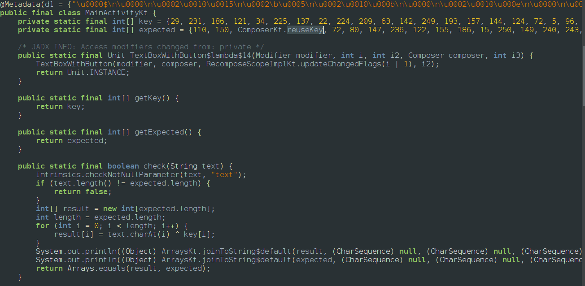

When we install the app we will be given a text box and a button when we enter something it gives wrong answer so lets go to jadx and find out whats causing and we couldnt findout much in main activity so after exploring jadx we found another man class called MainActivitykt 

we can find there is a check function where we have 2 arrays expected and key 
It xors our input and key and stores the value in result and compares it with result the Composekt.resuekey is 207 since xoring is reversable we might able to find result 
So we write a python function to get the expected output 
```python
key = [29,231,186,121,34,225,137,22,224,209,63,142,249,193,157,144,124,72,5,96,157,221,103,68,40,45,109,136,123,173,37]
expected = [110,150,207,72,80,147,236,122,155,186,15,250,149,240,243,207,21,59,90,3,173,237,86,27,70,28,30,188,23,153,88]
result = ""
for i in range(len(expected)):
    result += chr(expected[i] ^ key[i])
print(result)
```
and the output is `squ1rrel{k0tl1n_is_c001_n1s4l4}`
