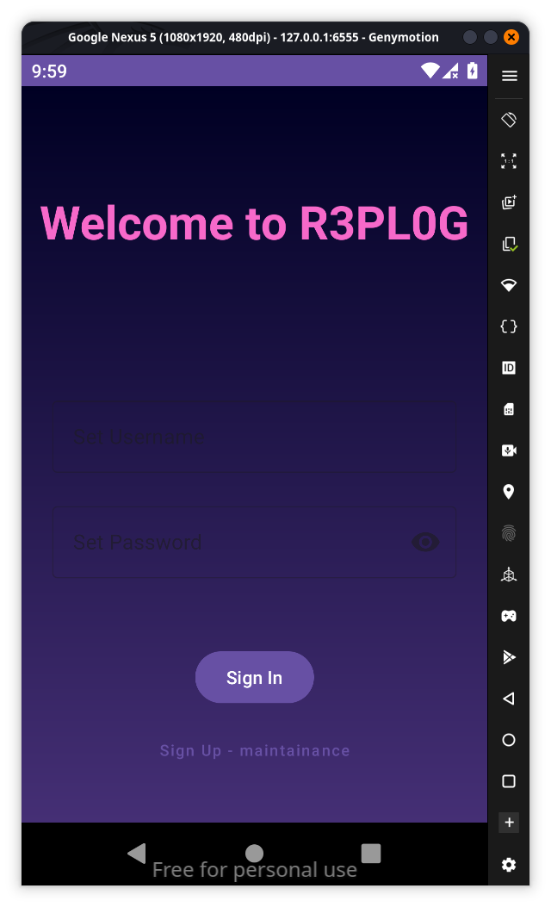
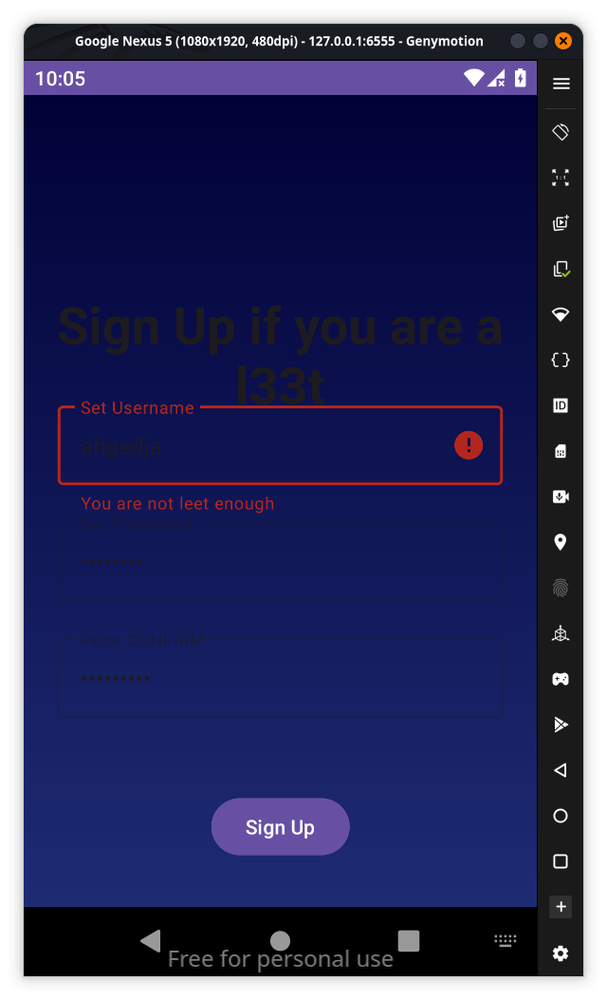
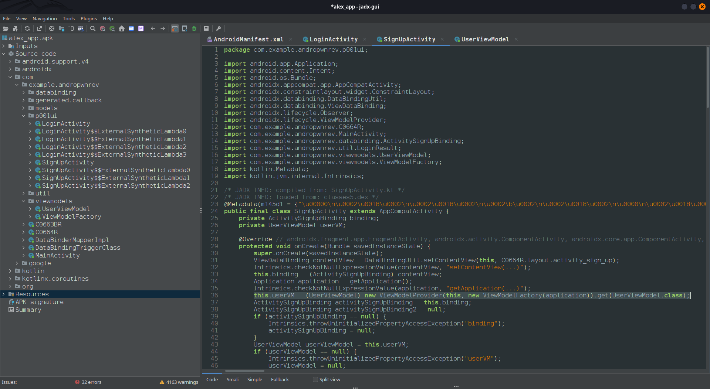
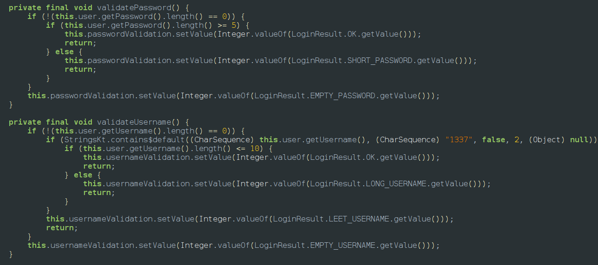
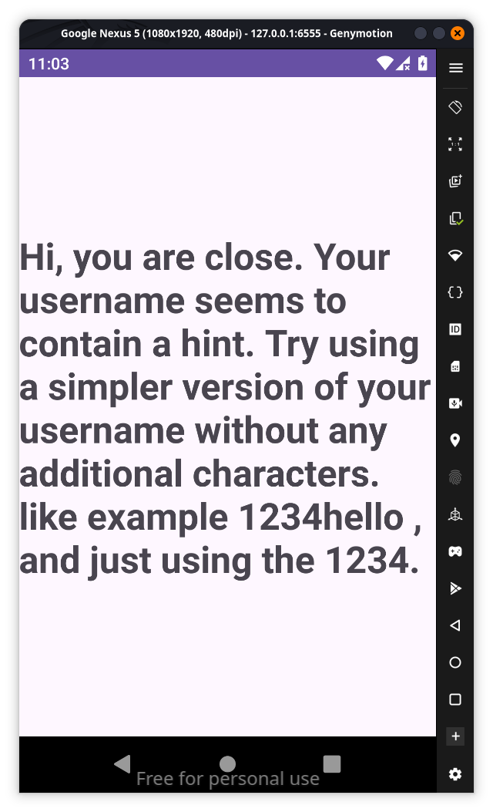
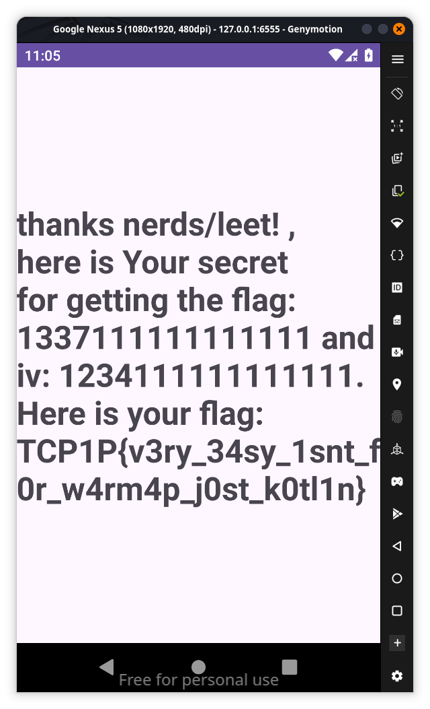

## Description:

**In the world of Android app development, Alex created a new app where hacking enthusiasts could test their skills with challenges. The signup process was Alex's way of ensuring that only the most skilled users could join. He worked hard to keep the app secure from unauthorized access. During this time, Alex encountered SkilledHackerLEET, a mysterious hacker known for testing digital defenses. Their back-and-forth challenge fascinated the app's users and showcased Alex's dedication to protecting his creation. In the midst of their rivalry, a puzzling message appeared: "To succeed, you must understand the app's flow and bypass its validation." This message added even more intrigue, making the app a place where only the best hackers could prove themselves.**

since the description says to understand the app’s flow and logic our first goal was to understand the app after downloading the app into our emulator the first screen is 

since its starting we dont know the credentials we go to signup but it says maintainance 
it asks user name and setup password we try something gibberish and it says

You are not leet enough so lets go to jadx to see what the real reason whats behind all this if we look at jadx 

As they mentioned alex is sure a good developer he used MMVM (Model-View-ViewModel) architecture to create this app which we could learn more from                                                       [Guide to app architecture  \|  App architecture  \|  Android Developers](https://developer.android.com/topic/architecture)
so we came to conclusion that Login activity and signup activity are mere activities which controls ui according to MMVM architecture if you see the highlighted part in the above image we could see the UserViewmodels are the one who are sending intent to login and signup activities to update on the screen so we come to a final decision that user view model activity is the main core brain of the app

in the user view model we can find this so it says the username should contain 1337 something like hello1337 and password should be anything less than or equal to length 5 so we try them

so we change the values to username 1337 and password is 12345

hence the flag is `TCP1P{v3ry_34sy_1snt_f0r_w4rmp_j0st-k0tl1n}`
