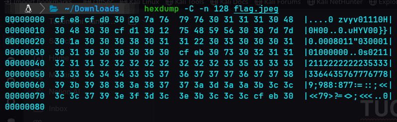

# My first encryption
According to the challenge description
**I just learned about xor! Apparently it's super strong, surely it can protect my secret file!**
we get a jpeg file which is encrypted which we can tell by looking at the first few lines of the hex using the command` hexdump -C -n 128 flag.jpeg` since the description mentioned about xor our first approach

we could see that the file is clearly encrypted since it is different from standard hex structure of jpeg

| **Byte Position** | **Flag.jpeg (Hex)** | **Standard JPEG (Hex)** |
| --- | --- | --- |
| **Byte 0** | `cf` | `ff` (Start of Image) |
| **Byte 1** | `e8` | `d8` (Start of Image) |
| **Byte 2** | `cf` | `ff` (Component Marker) |
| **Byte 3** | `d0` | `e0` (JFIF Header) |

we could repeatedly see that 30 is repeating many times which is a big red flag so lets trying xoring every number with 30 in binary (0011 0000) suprisingly we get the original hex bytes of  jpeg
we use [CyberChef](https://gchq.github.io/CyberChef/#recipe=XOR(%7B'option':'Hex','string':'30'%7D,'Standard',false)Render_Image('Raw')) and hex key as 30 we get the final output as 
