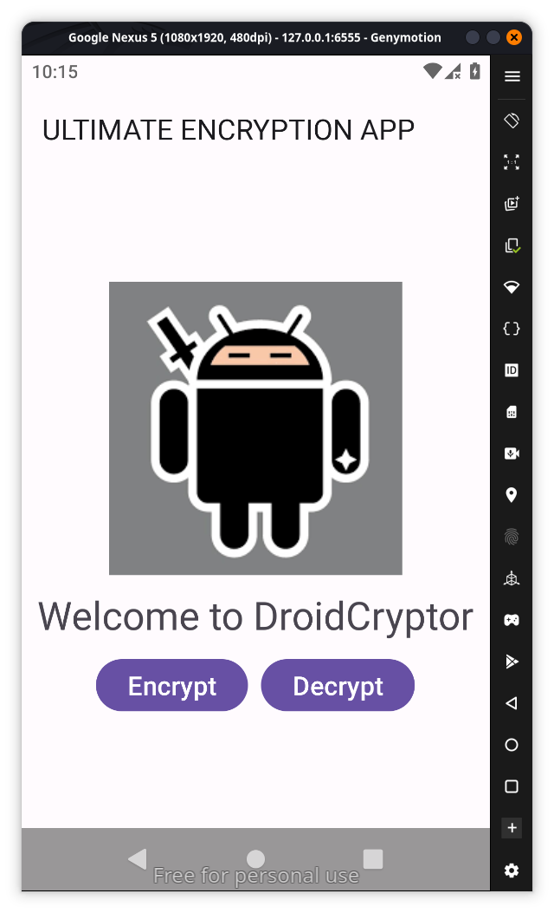
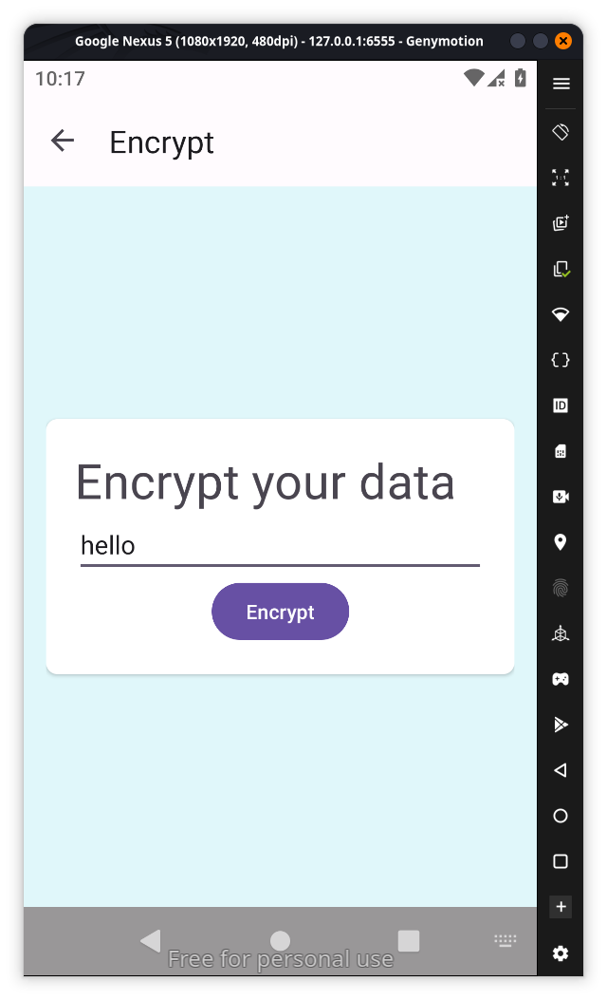
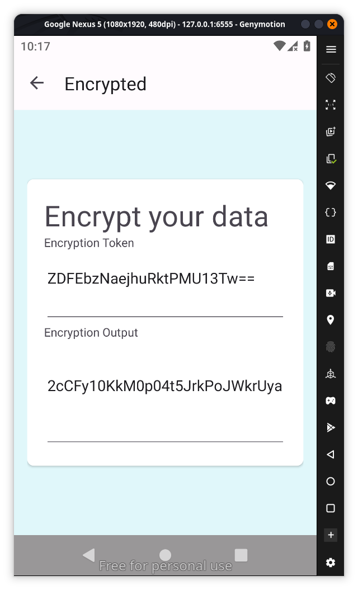
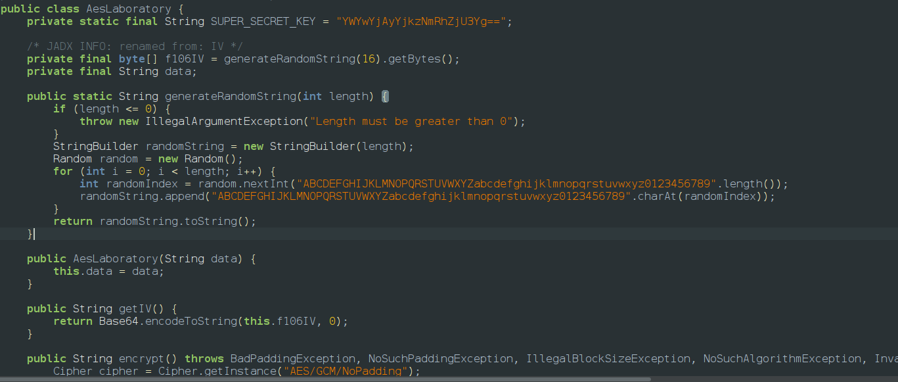

When we download the file we are given an apk and txt file the challenge says
**One of my friends told me about this application that promised to keep your data safe. When I tried to encrypt the data, I found out later that there is no way to view it! Can you retrieve my message?**
The txt contains base64 encoded strings
**Encryption Token: TXdESVBYeWc1dldkbHNFaQ==
Encryption Output: XZdGZ7pi9Ih4wHL/8Mj0q8/o6i/utS2tIsigHXCaEzpTXgesqtnLNJMbagqYH67ut9dbxhXC28w=**
tried to decode them using cyberchef but it generated some weird output so decided to view the source code 
Installed the apk in emulator and it has 2 options encrypt and decrypt and it says decrypt is under construction so no need to worry about that and we goto encrypt option

so now decrypt asks for a input and when we give one it gives 2 outputs similar to the encrypted.txt file so this must be the one 

and after the click we get weird output

we go to the source code and we cant find anything in main function so we continue to explore more functions and we find something interesting we found EncryotedFragment class which call AesLaboratory for encryption where the key is hardcoded

so we create a python script to reverse this encryption which takes key and encryption token and output 
we choose python because it has builtin tools
```python
import base64
from cryptography.hazmat.primitives.ciphers.aead import AESGCM

# 1. Your encoded data from the AesLaboratory class
key_b64 = "YWYwYjAyYjkzNmRhZjU3Yg=="
iv_b64 = "TXdESVBYeWc1dldkbHNFaQ=="
encrypted_b64 = "XZdGZ7pi9Ih4wHL/8Mj0q8/o6i/utS2tIsigHXCaEzpTXgesqtnLNJMbagqYH67ut9dbxhXC28w="

# 2. Decode Base64 to raw bytes
key = base64.b64decode(key_b64)
nonce = base64.b64decode(iv_b64)
ciphertext_with_tag = base64.b64decode(encrypted_b64)

# 3. Perform Decryption
# AESGCM automatically handles the 16-byte tag at the end of the data
aesgcm = AESGCM(key)
try:
    decrypted_bytes = aesgcm.decrypt(nonce, ciphertext_with_tag, None)
    print(f"Decrypted Result: {decrypted_bytes.decode('utf-8')}")
except Exception as e:
    print(f"Decryption failed: {e}")
```
so the flag is ptm\{th3nk_y0u_f0r_r3st0r1ng_mY_m3ss4g3!\}