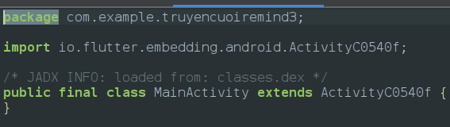
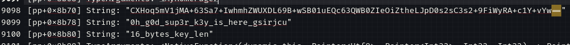

# Reminds a funny story
### Description
**Can you drop 10 million hearts for Remind's Funny Stories to get flag?**
When we install the app we can find out that it needs 10millionhearts to reveal the flag so went to jadx and found that its a flutter based apk 

so we are going to use  [https://github.com/worawit/blutter](https://github.com/worawit/blutter) for decompiling flutter code 
using blutter gives us 4 outputs 
1. ./asm (This the assembly code for every function)
2. pp.txt (Also called pool pointer, shows pointers of strings, objects. functions)
3. objs.txt (Gives the list of all the objects created and used in the code)
4. blutter_frida.js(This is the cool part after analyzing the function it automatically provides the frida script to bypass all the security checks)
<empty-block/>
so our first look would be in pp.txt because it contains pointers of strings and characters so our first search is for base64 and after using search function we can find a base64 string

and the below lines also look suspicious so using cyberchef we found out its aes encryption and we confirmed the following
```plain text
Data: CXHoq5mV1jMA+63Sa7+IwhmhZWUXDL69B+wSB01uEQc63QWB0ZIeOiZtheLJpD0s2sC3s2+9FiWyRA+c1Y+vYw==
Key: 0h_g0d_sup3r_k3y_is_here_gsirjcu
IV: 16_bytes_key_len
```
<empty-block/>
<empty-block/>
<empty-block/>