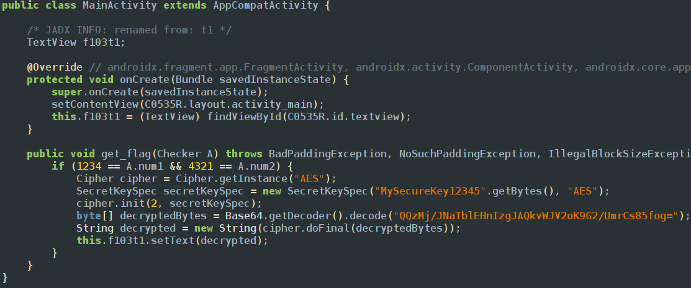
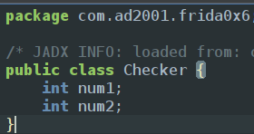

This challenge is combination of all the challenges we did till now since the conditions that are required get the flag are in another class so we have to change them and the main function to get the flag is in oncreate method and it is in main activity

checker class

so the java script code goes like
```javascript
Java.performNow(function() {
  Java.choose('com.ad2001.frida0x6.MainActivity', {
    onMatch: function(instance) {
      console.log("Instance found");
      var checker = Java.use("com.ad2001.frida0x6.Checker");
      var checker_obj  = checker.$new();  
      checker_obj.num1.value = 1234; 
      checker_obj.num2.value = 4321; 
      instance.get_flag(checker_obj);
    },
    onComplete: function() {}
  });
});
```
<empty-block/>