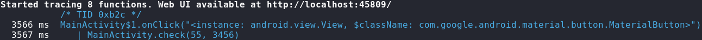
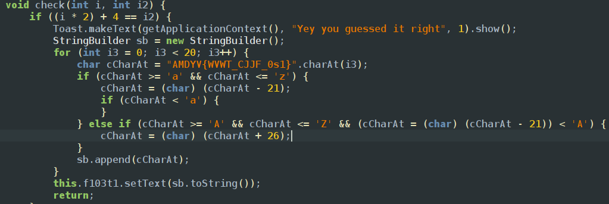
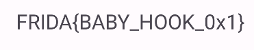

Opening the app we can see that the app is expecting for a number and verifying it 
so we can use frida trace to check what its executing using the command `frida-trace -U -j '*com.ad2001.frida0x1*!*' 'Frida 0x1'`

we can see its executing a check function from main activity we can find the code which returns the flag 

so according to the given conditions the integers that need to be passed into the function that returns the flag is 0,4
so i made the java script as 
```javascript
Java.perform(() => {
    var Interceptor = Java.use("com.ad2001.frida0x1.MainActivity");
    Interceptor.check.implementation = function(num1,num2) {
        return this.check(0,4)
    }
})
```
and we use return because else it will do the function multiple times and we got the flag using the command frida -U -f com.ad2001.frida0x1.MainActivity -l 0x1.js

<empty-block/>