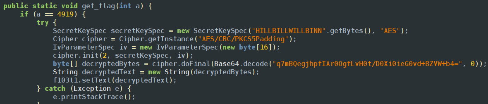

Installing the app in emulator and opening it says hook me and if we inspect the jadx we can find the actual process that decrypts the flag 

so in our code we have to just call get_flag function with argument int 4919
since its a static class we do not need to create a object to call the function
```javascript
Java.perform(() => {
    var a = Java.use("com.ad2001.frida0x2.MainActivity");
    a.get_flag(4919);
})
```
but when we try to load the flag using` frida -U -f com.ad2001.frida0x2 -l 0x2.js`
this actually starts the app from cold boot and tries to execute before the app does which is its general behavior but we need to let the app initialize the text view which is in oncreate method so the command i used first is `frida-ps -Ua`  to find the currently running processes in my emulator and found that the pid of the app is 4312 and then i used `frida -U -p 4312 -l 0x2.js` targetting the certain process since there is no f flag it doesnt start from cold start and let the app create oncreate method and then injects our script
<empty-block/>