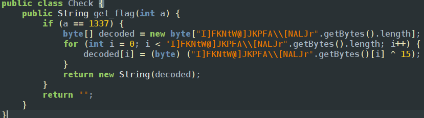
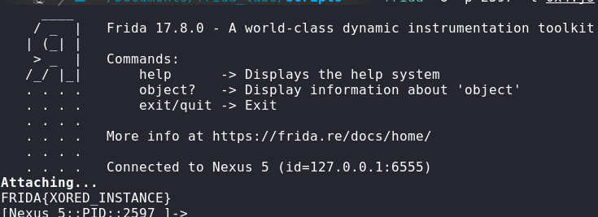

The app is simple there is only one text view if we inspect deeper into the tree of the app strutcure we can find a check class which contains the flag to get the flag

so we have to implement the same function using frida satisfying the condition to get the flag and as the previous challenge we have to let the textview load and then let the function execute so the frida script will be
since the class isnt a static we have to create a object to access it 
```javascript
Java.perform(() => {
  var check = Java.use("com.ad2001.frida0x4.Check");
  var check_obj = check.$new(); 
  var res = check_obj.get_flag(1337);
  console.log(res);
})
```
using the commands `frida-ps -Ua` to get the pid of the process then` frida -U -p 2597 -l 0x4.js `

