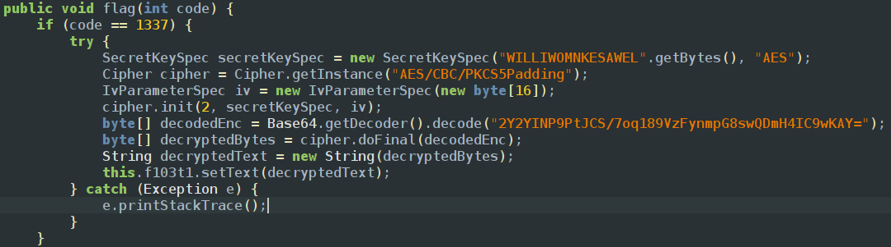

The app contains only a textview and a function similar to previous function 
but if you observe code we can see the function changes the ui of the app

ui updates on based on threads and android has a main thread which is also called looper() which runs the functions and updates users screen executing functions in a order this is closely related to android life cycles
using basic frida like we did to previous challenges we just did mathematics and logic reasoning but not updating the screen because 
in order to implement these kind of functions we have link with main thread so the process will be
1. Run the oncreate method and set the text view
2. since there is no button to call the function we have to call it manually using frida using the instance which is already created and set the flag 
```javascript
Java.performNow(function() {
  Java.choose('com.ad2001.frida0x5.MainActivity', {
      onMatch: function(instance) { 
        console.log("Instance found");
        instance.flag(1337); 
    },
    onComplete: function() {}
  });
});
```
`Java.performNow()` attaches the current thread to the Java VM, ensuring Java operations can execute safely.
We use `Java.choose()` and specify the target **class name** (like `com.example.MainActivity`). Frida scans the **target app's Java heap memory** for live instances of that class.
`onMatch` is the callback function of `Java.choose()`. It receives each **live instance** as a parameter and gives us access to the real objects currently running in the app.
We can then modify those live objects using our Frida script.
so then we get the flag