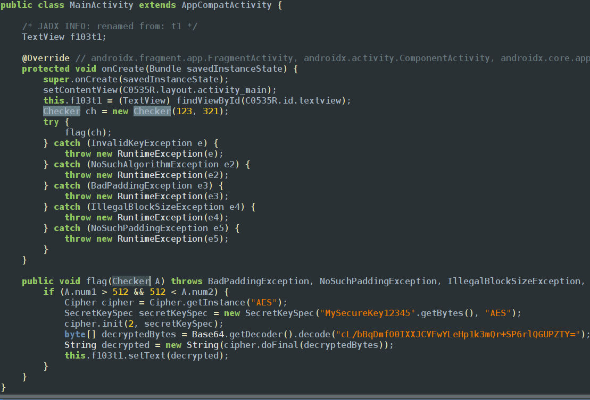
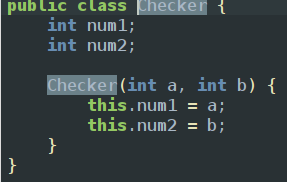

The challenge is similar 0x6 but this time we have to pass the required values to get the flag as arguments of a function

checker class

There are 2 methods to solve this challenge
### Method1:- passing the required arguments
```javascript
Java.performNow(function() {
  Java.choose('com.ad2001.frida0x7.MainActivity', {
    onMatch: function(instance) {
    console.log("Instance found");
    var checker = Java.use("com.ad2001.frida0x7.Checker");
    var checker_obj  = checker.$new(600, 600);
    instance.flag(checker_obj);
  },
    onComplete: function() {}
  });
});
```
### Method2:- Hooking the constructor class
