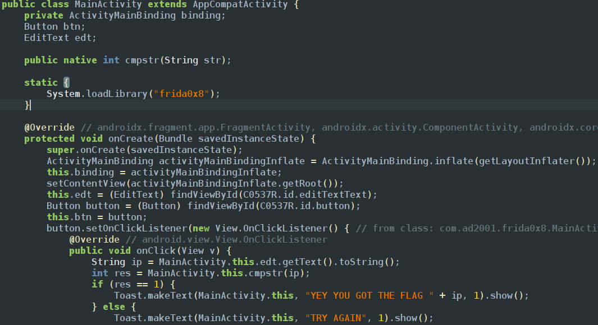
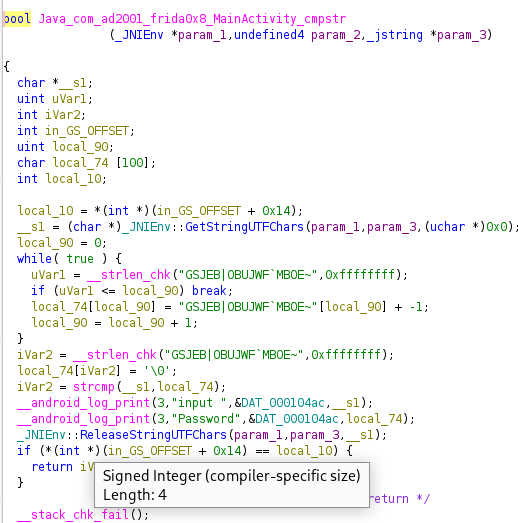

This challenge uses native lib functions in order to check the entered string if we look into our app its asking for a string 

exploring jadx we can find its using a function cmpstring and passing the argument as str and the native file name is frida0x8

so lets use ghidra to know what exact string its expecting us to get

we could see that its a boolean type function and in cpp its either 1 or 0 and in jadx code we can see 1 gives the flag so our taskis to hook the strcmp function and then set the returned value to 1 
To hookup the function we need the complete name of the function which we could see in ghidra we need the actual address of the function 
to get the address you can run `Module.enumerateImports(nativefile.so)` to get list of imports if it is using functions from other files and `Module.enumerateExports(nativefile.so)` to get the adress of the list of the junction which are used in this file 
so we found out strlen_chk is from another file and function name strcmp so the exact address of the function is module [libc.so](http://libc.so) and function name strcmp
so we finally design our js code if we can see the 1st argument is being compared to the 2nd argument which we entered through edittext so we are going to print that 2nd argument using console.log
```javascript
var strcmp = Process.getModuleByName("libc.so").getExportByName("strcmp");
Interceptor.attach(strcmp, {
    onEnter: function (args) {
            var s2 = args[1].readUtf8String();
            if (s2 && s2.indexOf("FRIDA") !== -1) {
                this.is_the_one = true;
                console.log("[!] FOUND PASSWORD: " + s2);
            }
    },
    onLeave: function (retval) {
        if (this.is_the_one) {
            retval.replace(0); // 0 means "Strings are identical"
            console.log("[+] Bypass successful!");
        }
    }
});
```

