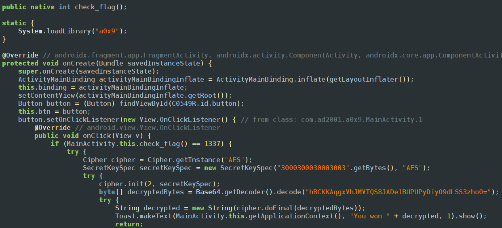
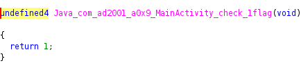

This challenge is similar to previous challenge function is in native files so we use `Module.enumerateImports(nativefile.so)` to get the imports and all the functions it uses so we find the lib file and method name that we can use 

we can see that if chk_flag returns 1337 it prints the flag ion the screen so we have to go ghidra and check the function 

the chk_flga always returns so we to replace the return value there is nothing to about the entering arguments so the frida code will be 
```javascript
var target = Process.getModuleByName("liba0x9.so").enumerateExports()[0].address;
Interceptor.attach(target, {
    onEnter(args) {  },
    onLeave(retval) {
        console.log("Original return: " + retval);
        retval.replace(1337);
        console.log("[+] Return value forced to 1337");
    }
});
```
and finally the flag gets printed on the screen as FRIDA\{NATIVE_0X2\}