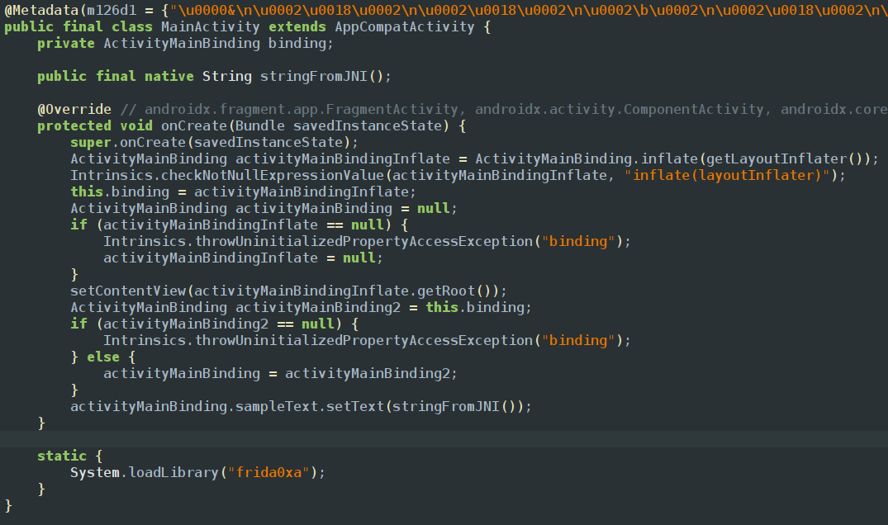
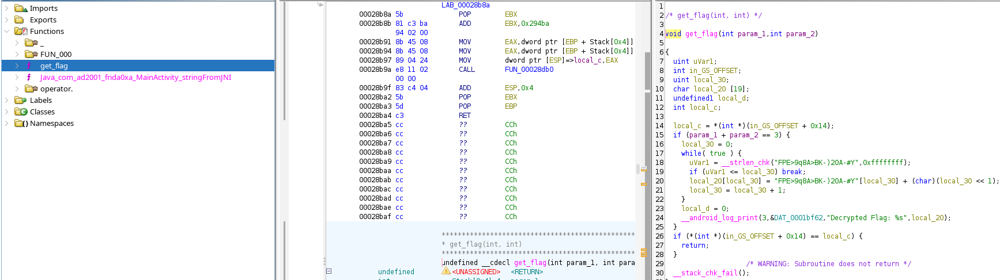
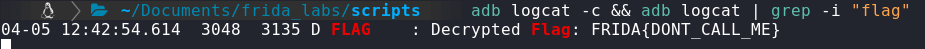

In this case we find a text view and we get to know that the text view string is getting loaded from the string jni function from native files 
using ghidra we can find the native function then we can see another function that is in native file but there is no method to start it from the main code
In all the previous cases which we dealt with native files the function is called but in this we have to call the native function

and the below is ghidra image

we can see that the getfkag function takes 2 parameters then adds both of them and will check if its equal to 3 if its true it prints the flag using console.logs() 
To call a native function in frida, we need an `NativePointer` object. We should  the pass the address of the native function we want to call to the NativePointer constructor. Next, we will create the `NativeFunction` object , this represents the actual native function we want to call. It creates a JavaScript wrapper around a native function, allowing us to call that native function from frida.
<empty-block/>
instead of that long process we can just use the same old method to get address which is `Module.getEnumarateImports()` and we can create a new object to native function as given in below code
```javascript
var addr = Process.findModuleByName("libfrida0xa.so").getExportByName("_Z8get_flagii");
var get_flag = new NativeFunction(addr, 'void', ['int', 'int']);
get_flag(1, 2);
```
as mentioned in the code that the flag will get printed in logs we can use adb logcat to view the logs and give some extra flags so that we get clean and filtered output
