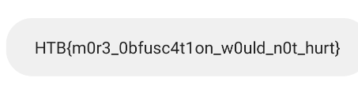
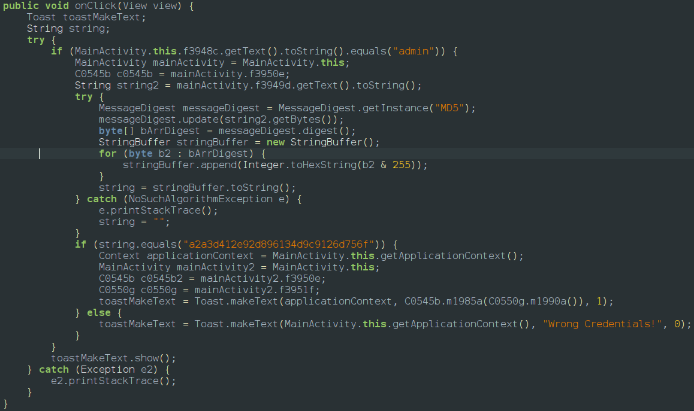

If we look at the app it asks for a username and password if we look at jadx the username is admin and the password is a md5 hash there is no way to decrypt a hash so we will use frida we start the frida server and launch frida and paste our script in frida repl
the script is
```javascript
Java.perform(function() {
    var String = Java.use('java.lang.String');
    String.equals.overload('java.lang.Object').implementation = function(other) {
        try {
            if (other.toString() === 'a2a3d412e92d896134d9c9126d756f') {
                console.log('[*] Bypassed!');
                return true;
            }
        } catch(e) {
            // ignore
        }
        return this.equals(other);
    };
    console.log('[*] Hook ready, now enter admin + any password');
});
```
so when you run the script we get the flag as a toast message

the jadx is

