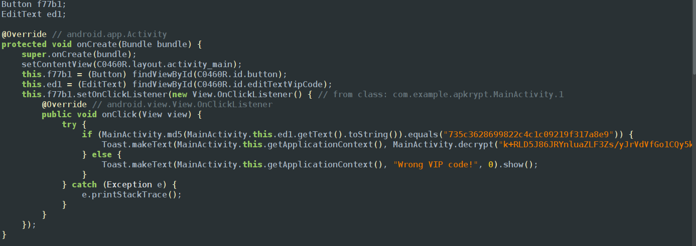
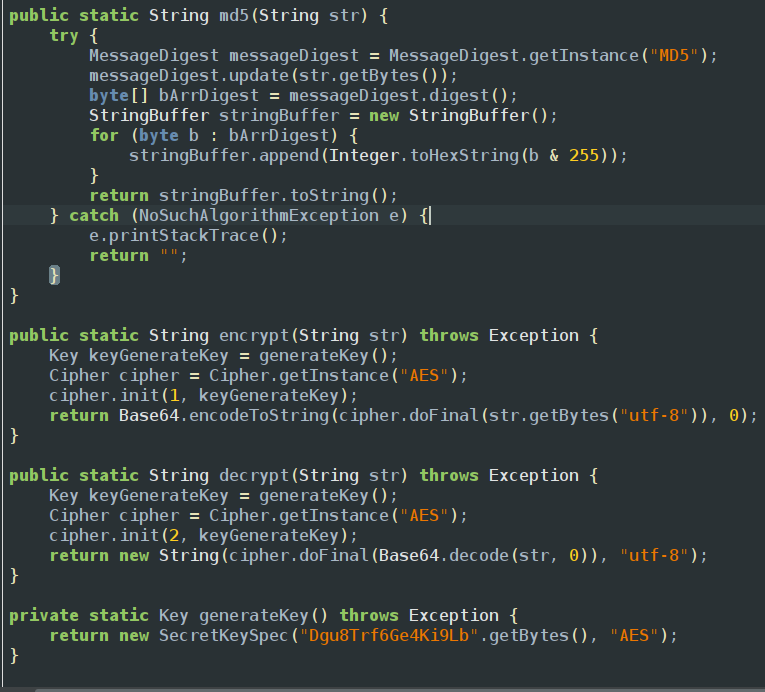
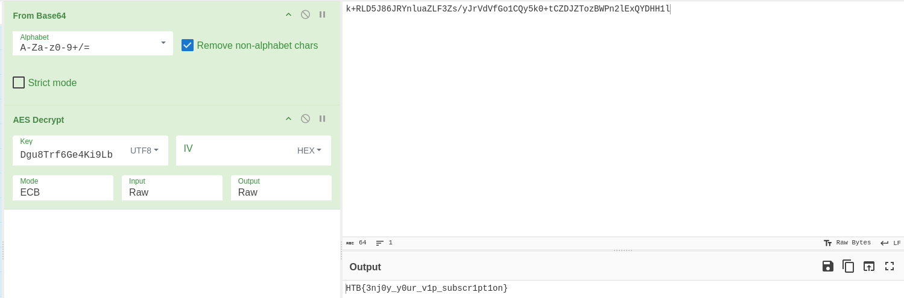
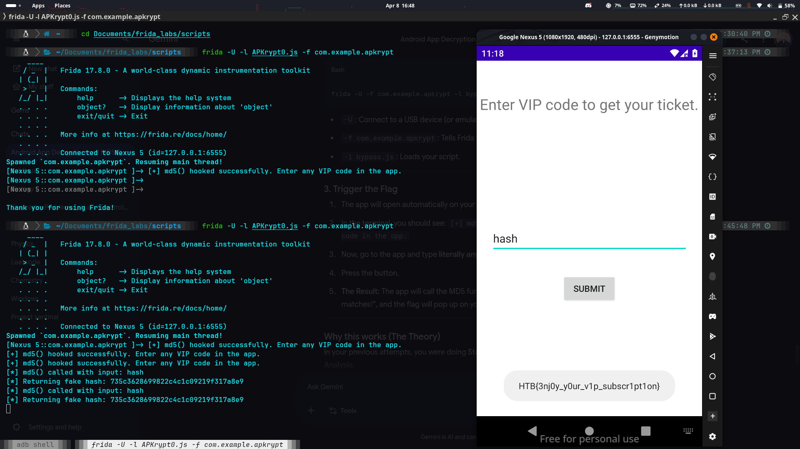

When i tried to install the apk in my genymotion it showed an error which is 
`adb install APKrypt.            
Performing Streamed Install
adb: failed to install APKrypt.apk: Failure [-124: Failed parse during installPackageLI: Targeting R+ (version 30 and above) requires the resources.arsc of installed APKs to be stored uncompressed and aligned on a 4-byte boundary]`
so what is this error?
Android uses a technique called **memory-mapping** (mmap) to read `resources.arsc`.
- If the file is **uncompressed and aligned**, the OS can read the resources directly from the APK file on the disk without loading the whole thing into RAM.
- If it is compressed or misaligned, the OS would have to extract it to memory first, which wastes RAM and slows down the app's startup time.
so our apk is misalgined so we have to zip align it again using apk tool and then create a key and then sign the apk and install it so the series of commands go like
what is 4-byte boundary?
In computing, a **4-byte boundary** refers to **Memory Alignment**. It is a rule that says a piece of data must start at a memory address that is a multiple of 4.
If you imagine your computer's RAM as a long line of numbered boxes (addresses), a 4-byte boundary means the data can only start at boxes numbered **0, 4, 8, 12, 16, 20...** and so on.
Computer memory isn't actually read one byte at a time. To be fast, the CPU reads memory in "chunks" or **words**. On most modern systems, a word is 4 bytes (32-bit) or 8 bytes (64-bit).
If a 4-byte integer is "aligned" on a 4-byte boundary (e.g., starts at address 4), the CPU can grab the whole thing in **one single fetch operation**.
The series of steps are 
```bash
#align the apk
zipalign -v -p 4 APKrypt.apk APKrypt_aligned.apk
#Generate a debug key if you don't have one
keytool -genkey -v -keystore debug.keystore -storepass android -alias androiddebugkey -keypass android -keyalg RSA -keysize 2048 -validity 10000
#sign the apk
apksigner sign --ks debug.keystore --ks-pass pass:android APKrypt_aligned.apk
```
if we open the app we can see its waiting for an input 

so to view the code you go to the jadx and find the vip code we entered is converting into a md5 hash and then compared to hardcoded string and then the flag is encrypted with aes and the key is alos present down in the decrypt and key generation functions below

above is the function which checks your entered vip code and reveals the flag and below are the functions that are used to decrypt and encrypt functions for the strings and aes keys

since md5 is a hash we cant find it simply like base64 or aes decrypted strings so its better to findout the flag since you already have the key we can use cyberchef and use aes decryption

also we can also do it by frida which we can write a script which results the string comparison always true so the js code will be
```javascript
Java.perform(() => {
    var MainActivity = Java.use("com.example.apkrypt.MainActivity");

    MainActivity.md5.implementation = function (input) {
        console.log("[*] md5() called with input: " + input);
        var fakeHash = "735c3628699822c4c1c09219f317a8e9";
        console.log("[*] Returning fake hash: " + fakeHash);
        return fakeHash;
    };
    console.log("[+] md5() hooked successfully. Enter any VIP code in the app.");
})
```
and the final output will be getting the flag

HTB\{3njoy_y0ur_v1p_subscr1pt1on\}