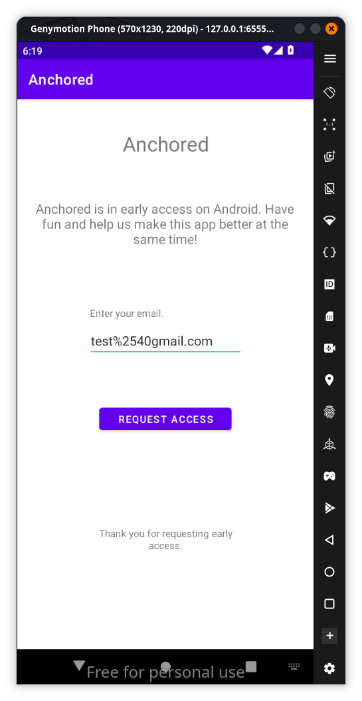
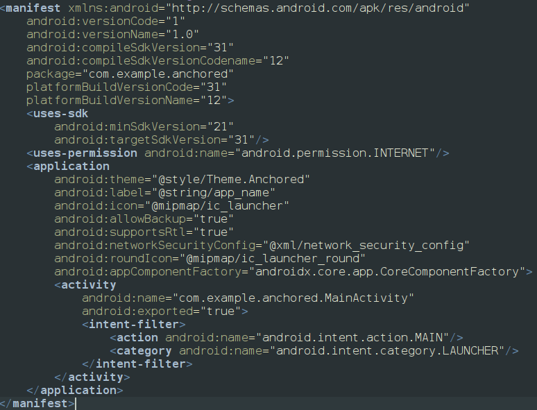
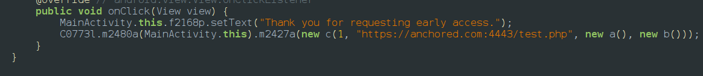
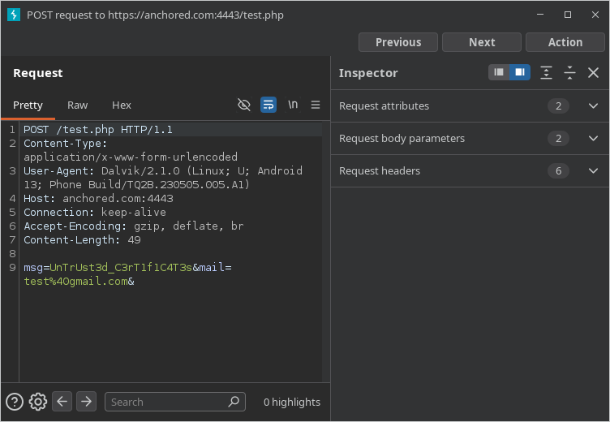

When we try to open the apk we get a toast message that the device is rooted and app doesnt open so we install a non rooted device in genymotion and we install the app and when we open the app it waits for us to enter a gmail and it doesnt check weather its correct or not it just sends information via internet

if we look at the android manifest we can see that app actually have internet permission so its a worthy try burp suite and intercept the traffic to get what information it actually sends

patch the apk start it using frida change the domain to your local host and start using burp to get the traffic information that is sent to the php server which is mentioned in the code when the submit button is clicked

when we finally interecot traffic we get the flag 

