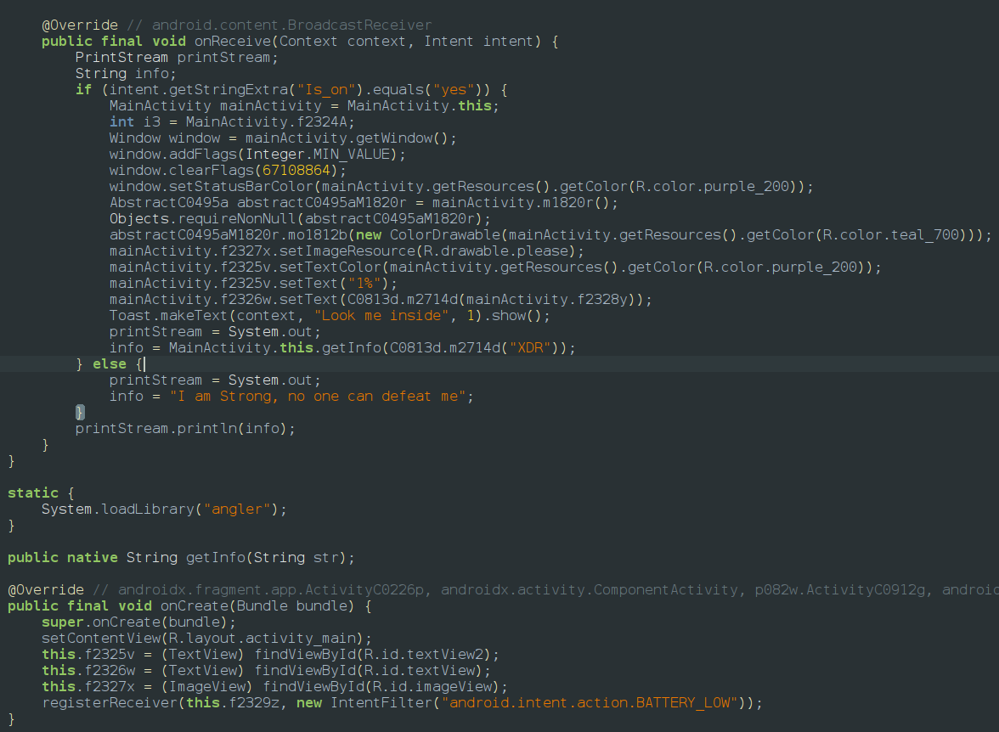
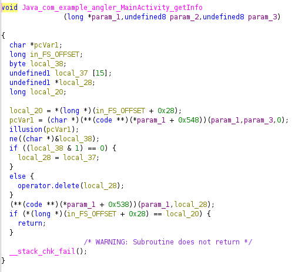
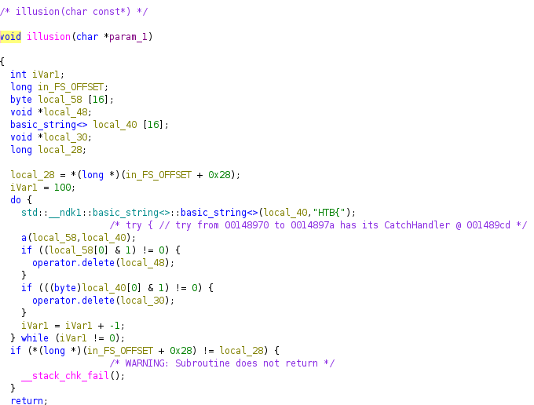

If we look at the app it initially says 

if we look at jadx code we can find that there is a broadcast waiting for an intent so we use that intent to start that service and there appears a toast message that LOOK INSIDE so the jadx also shows us it uses a native file [libangler.so](http://libangler.so) it might contain the flag 

the broadcast is a android broadcast which activates when battery is at 1% so we send a fake broadcast to the app tricking it to believe the battery is 1% along with a string yes for a variable Is_on `adb shell am broadcast -a android.intent.action.BATTERY_LOW --es Is_on yes`
then the app displays a new screen

so we load the native file into ghidra and we can find 3 functions

this is the entry point to the native function it also calls functions illusion and ne so if we explore them

this is clearly a fake function which doesnt give anything as mentioned in code so we go to ne function 
