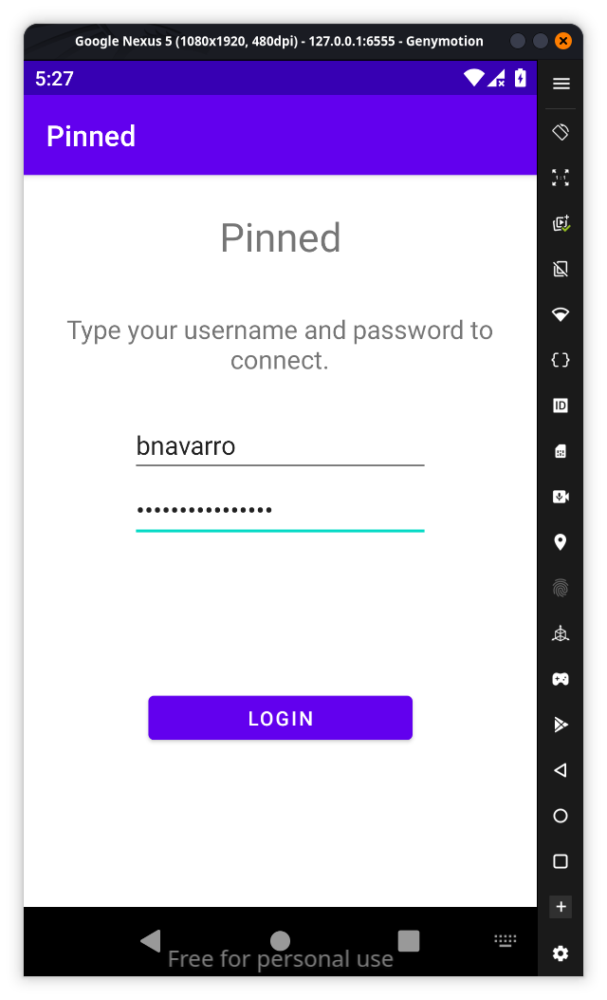
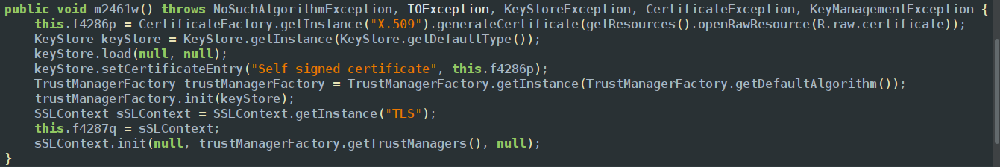
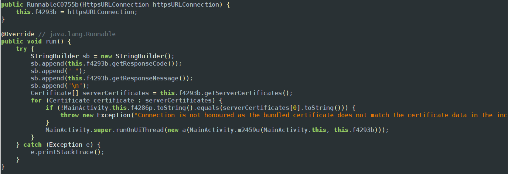
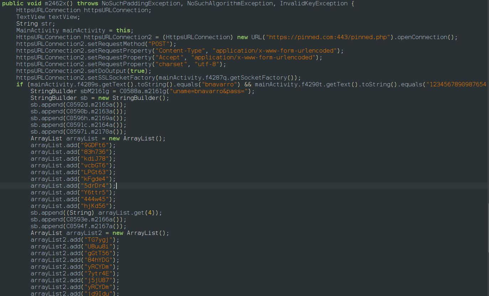
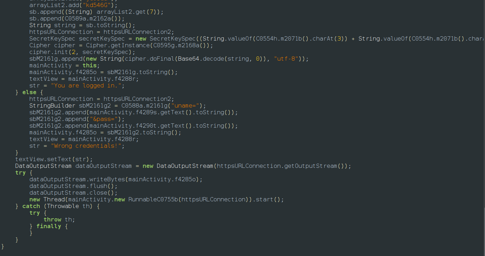

[info ](./Pinned/info.md)
on opening the app we can see there is already an input text user name and password so the basic idea of the app is when we enter the correct credentials the app sends a http request using different methods in background so our goal is simple bypass all the security checks and act as mitm between app and server to catch the request using burp suite

if we look at the code with the help of jadx we can see multiple checks 
<u>1st protection level</u>

Custom Trust Manager (Hardcoded Trust)
Method Name: m2461w()
What it does: Instead of trusting the Android System's list of authorities (like Google or Digicert), the app loads a specific file from R.raw.certificate. It creates a KeyStore and initializes a TrustManagerFactory that only accepts this one certificate.
Impact: This is the first line of defense against tools like Burp Suite. If Burp presents its own certificate, the app rejects the connection immediately.
<u>2nd protection level</u>

Post-Handshake Certificate Validation
Method Name: RunnableC0755b.run()
What it does: This is a "double-check." Even if the TLS connection is established, the app manually extracts the server's certificate using this.f4293b.getServerCertificates() and compares its string representation to the bundled certificate.
Code Trigger: if (!MainActivity.this.f4286p.toString().equals(serverCertificates\[0\].toString()))
Impact: This makes generic SSL bypasses harder because the check happens inside the application's logic rather than the system's networking library.
<u>3rd security check</u>
The 3rd security is very big it handles the input validation then as we discussed it sends a http request by appending different parts of strings using 16 different methods and finally append it and send the url

so we manipulate the emulator acting on our local host and enter the correct username and password and click the button 
To pass the security checks i have re patched the apk using objection which injects frida-gadget into the files and using objection we could bypass all the security checks by disabling them using objection with a single click then use burp suite which catches the request and it contains flag
 

