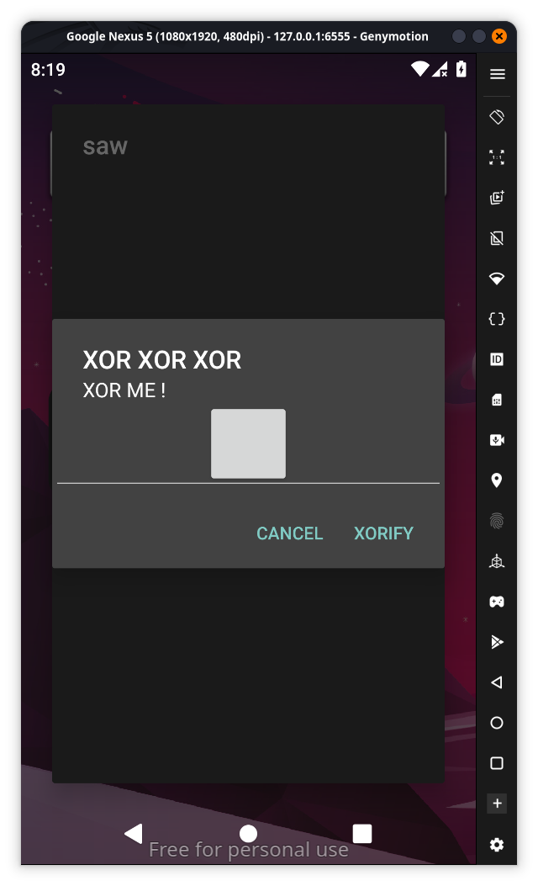
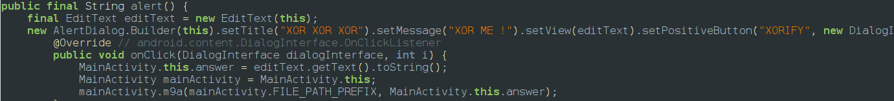
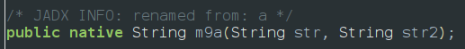
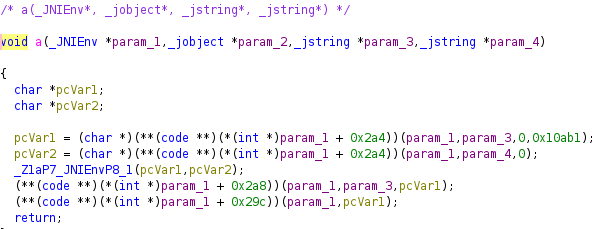
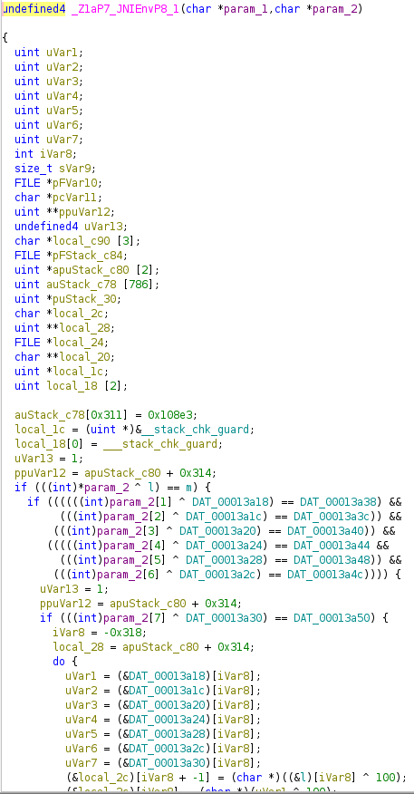
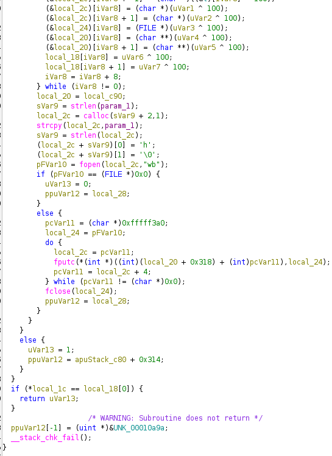
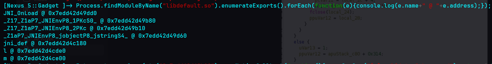
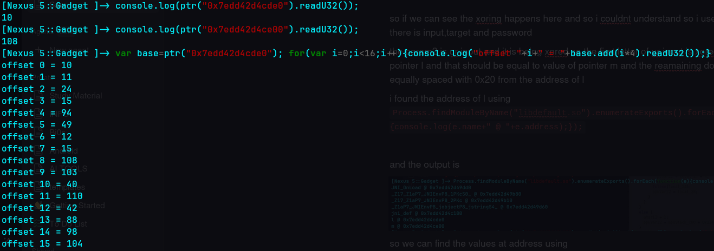
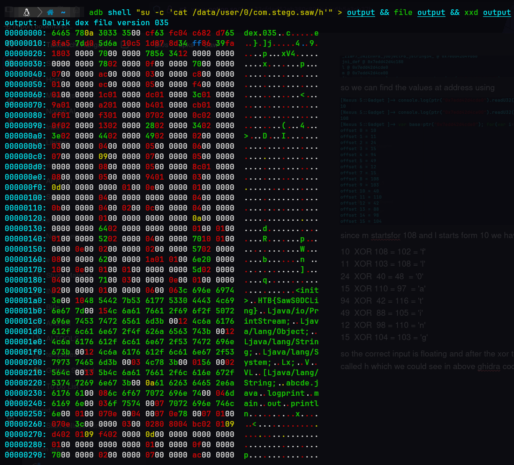

This was mostly solved by ai but i understood the core process
So when i tried to open the app it wouldnt open so then i checked the code and found put it need 2 extra strings to actually launch the app 
i have patched the apk using objection so we have to even start frida
As we can see the app doesnt have any screen it uses a floating window so we have to go to setting and allow the app to display over the other apps 

so when we look at jadx there are native file called libdefault which is being used and when we give our input in the box for proceeding it xoring it takes 2 inputs the current dir of the app and the users input and passes it a function m9a which we can see a comment that it is renamed from a

<empty-block/>

<empty-block/>
so we use ghidra to findout the actual logic we inspect function a

we can see its calling a function _z1a..1 with 2 arguments this is where the main process starts 

<empty-block/>
so if we can see the xoring happens here and so i couldnt understand so i used ai and it told me there is input,target and password by lookimng at th eor function we can come to a conclusion that it is a 8 letter password
the param2 is ur input and it is being xored so the first letter of ur input is xored with  value of pointer l and that should be equal to value of pointer m and the reamaining down are the address equally spaced with 0x20 from the address of l 
i found the address of l using `Process.findModuleByName("`[`libdefault.so`](http://libdefault.so/)`").enumerateExports().forEach(function(e){console.log(e.name+" @ "+e.address);});`
<empty-block/>
and the output is 

so we can find the values at address using 

since m startsfor 108 and l starts form 10 we have to xor them in order to get the correct input
10  XOR 108 = 102 = 'f' 11  XOR 103 = 108 = 'l' 24  XOR  40 = 48  = '0' 15  XOR 110 = 97  = 'a' 94  XOR  42 = 116 = 't' 49  XOR  88 = 105 = 'i' 12  XOR  98 = 110 = 'n' 15  XOR 104 = 103 = 'g'
so the correct input is floating and after the xor test passes it creates a new file in current directory called h which we could see in above ghidra code so if we move to the path 

we could see the flag right there in hexdump HTB\{SawS0DCLing\}