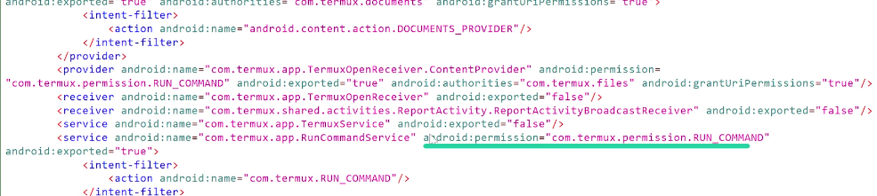
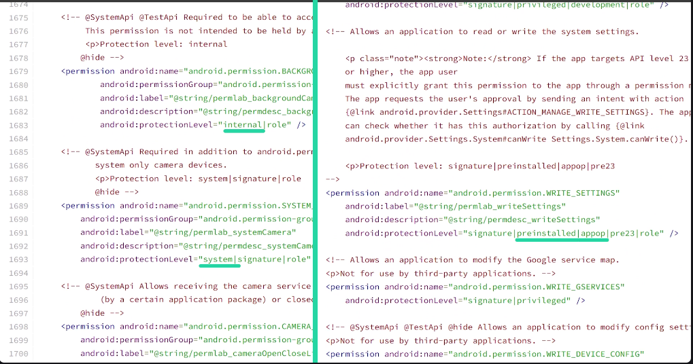

<empty-block/>
without setting android persmission to true we can still let other apps open our app through this permission
<empty-block/>
<empty-block/>
permission works with intent 2 you cant request a permission if its not mentioned previoulsy in android manifest
<empty-block/>
our attack a pp should have permission that are relatively lower than our target app
<empty-block/>
<empty-block/>
