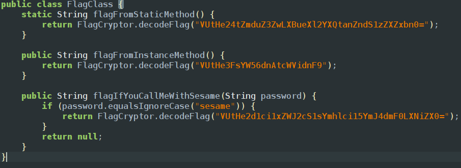
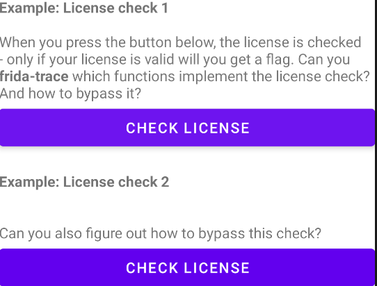
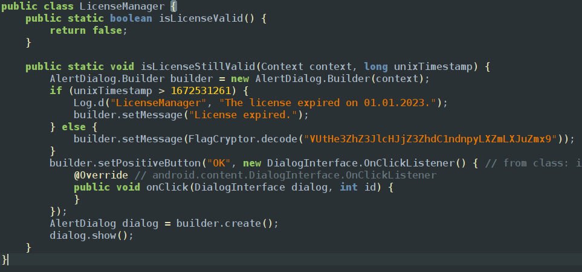
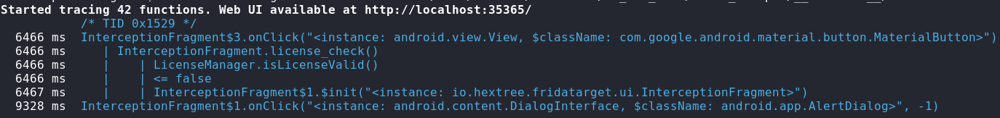
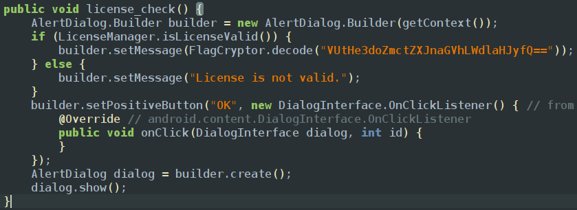
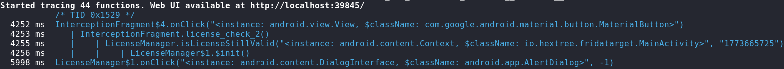
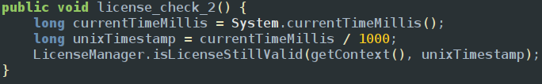
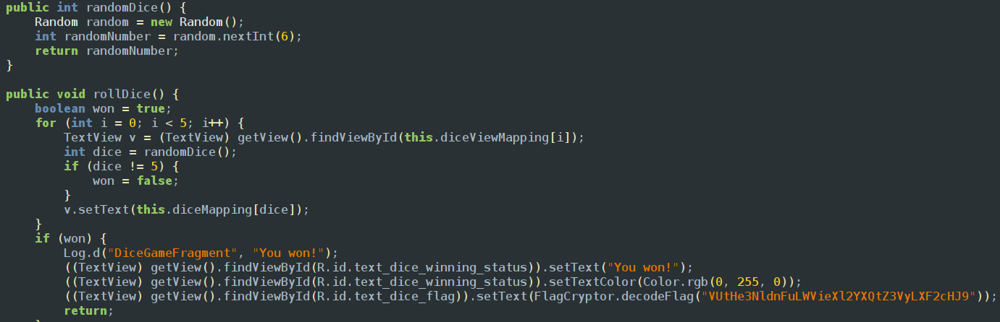

<empty-block/>
Downloaded frida server from github and then stored it in the app internal files /data/local/tmp files and started the server if we inspect the functions which iare in flag class we can see 
!st is a static function so we dont need to create an object for that function we can directky call through its class 

The secoond one is a non static method so we have to create a object to call it and 3rd one is similar to 2nd one but we have to pass a variable which is sesame and use it in script
We will specify the class name and start executing our functions and print it using console.log function
```javascript
Java.perform(() =>{
    let FlagClass = Java.use("io.hextree.fridatarget.FlagClass");
    console.log(FlagClass.flagFromStaticMethod());
    let FlagObj = FlagClass.$new();
    console.log(FlagObj.flagFromInstanceMethod());
    let FlagObj1 = FlagClass.$new();
    console.log(FlagObj.flagIfYouCallMeWithSesame("sesame"));
})  
```
and we get the flags
<empty-block/>
### License checker

From the below jadx code we can see that there are 2 functions 
1. isLicenseValid function checks weather the license is valid or not and prints the flag when its true
2. isLicenseStillValid returns the encrypted flag if unixTimestamp is gretater than 1672531261

if we use frida trace and use the the License check 1 click here button we could see which all classes are being used and the functions being used 
the command to use frida trace is to trace all the functions executing in the app is 
`frida-trace -U -j 'io.hextree.`*`!`*`' FridaTarget`

we could see that if the button is clicked it is loading a license_check() from InterceptorFragment class and if we take a look of that class in jadx we could find the license_check functions

this function only works if the function isLicenseChecker returns true it will load our flag and the java script which i prepared was
```javascript
Java.perform(() => {
    let InterceptionFragment = Java.use("io.hextree.fridatarget.LicenseManager");
    InterceptionFragment.isLicenseValid.implementation = function() {
        return true;
    }
})
```
this function performs the LicenseManager class isLicenseValid function andsets the value to true
Now if you use the same frida trace command for license check 2 you get

we could see that if we click on the button its loading license_check2 function from InterceptorFragment class

UnixTimestamp is used to represent time because many different regions have different times and different formats on writing dates also 24hrs and 12hrs formats to solve that they introduced unix time stamps to calculate time differences between times
so its taking current time in milliseconds since January 1, 1970 (Unix Epoch) and dividing by 1000 and sending it back to isLicenseStillValid() function and it returns the flag if it meets the conditions
so we need to change the arguments in isLicenseStillValid() for which i used the java script code
```javascript
Java.perform(() => {
    let InterceptionFragment = Java.use("io.hextree.fridatarget.LicenseManager");
		LicenseManager.isLicenseStillValid.implementation = function (context, timestamp) {
        console.log("timestamp:", timestamp);
        return this.isLicenseStillValid(context, 0);
    };
});
```
<empty-block/>
### Dice game
In this game there is a button to roll a button if we explore in the jadx we could find DiceGameFragment class which is used for the dice game 

the code generates a 6 random numbers using random.nextInt() and if the random number to reach the win and setting it true we have to set all the random numbers to 5 
<empty-block/>