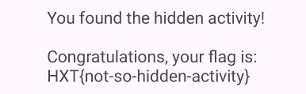
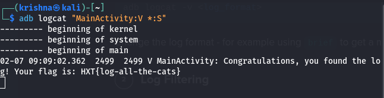

### Flag1
installed the application using command adb install adb_test-application.apk
started the activity to find the flag HXT\{Ready-to-Android\}

### Flag 2
dumpsys tell us the system services and their states of the system 
adb shell pm list packages \| grep adb to know the package name also we can use adb shell pm list packages -3 to know the 3rd party applications
adb shell dumpsys package io.hextree.adbtestapplication gives the system services and their states 
In the android manifest xml file we can see HiddenActivity is exported as true so we can start it using the command
adb shell am start -n io.hextree.adbtestapplication/.HiddenActivity    

### Flag 3
Logcats tell us the systems information such as activities that are in function with time stamps , errors occured and crashes happened using logcat developers and attackers see what exactly is happening in the app

[In the context of Logcat, ](https://www.bing.com/ck/a?!&&p=766f31c6393c7a289a5f68314fbed341b71ad4ba50bf0cd94475939f7fafe571JmltdHM9MTc3MDQyMjQwMA&ptn=3&ver=2&hsh=4&fclid=3a1b280b-8884-6a1a-0a4a-3ee789676b9a&u=a1aHR0cHM6Ly9jb21tYW5kbWFzdGVycy5jb20vY29tbWFuZHMvYWRiLWxvZ2NhdC1jb21tb24v&ntb=1)[**verbose**](https://www.bing.com/ck/a?!&&p=766f31c6393c7a289a5f68314fbed341b71ad4ba50bf0cd94475939f7fafe571JmltdHM9MTc3MDQyMjQwMA&ptn=3&ver=2&hsh=4&fclid=3a1b280b-8884-6a1a-0a4a-3ee789676b9a&u=a1aHR0cHM6Ly9jb21tYW5kbWFzdGVycy5jb20vY29tbWFuZHMvYWRiLWxvZ2NhdC1jb21tb24v&ntb=1)[ refers to the level of detail provided in the logs. Verbose logs include the most detailed information possible, such as the most detailed logs, which are particularly useful for identifying subtle issues during the development process. Unlike standard log levels (ERROR, WARN, INFO, DEBUG), verbose logging (VERBOSE) includes the most detailed logs, providing critical insights when debugging complex issues.](https://www.bing.com/ck/a?!&&p=766f31c6393c7a289a5f68314fbed341b71ad4ba50bf0cd94475939f7fafe571JmltdHM9MTc3MDQyMjQwMA&ptn=3&ver=2&hsh=4&fclid=3a1b280b-8884-6a1a-0a4a-3ee789676b9a&u=a1aHR0cHM6Ly9jb21tYW5kbWFzdGVycy5jb20vY29tbWFuZHMvYWRiLWxvZ2NhdC1jb21tb24v&ntb=1)

the command adb logcat “MainActivity:V \*:S”  v stands for verbose and \*:S stands for making the logacts silent for all other actvities