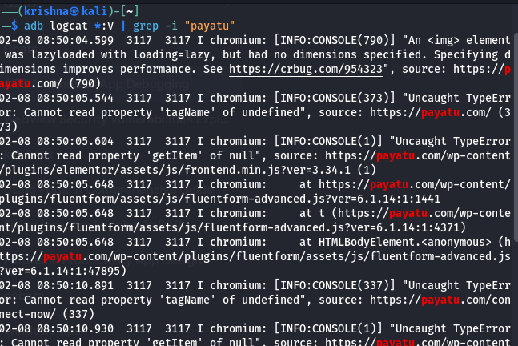
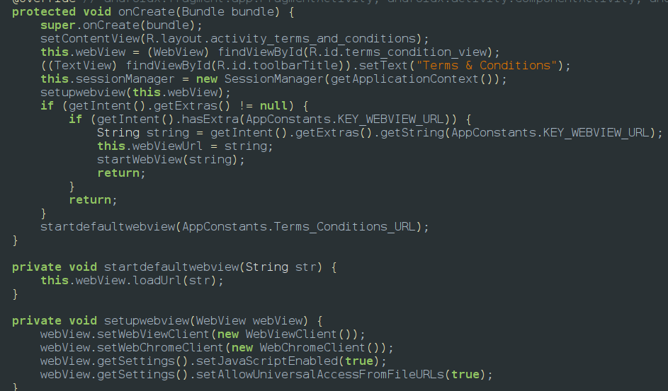
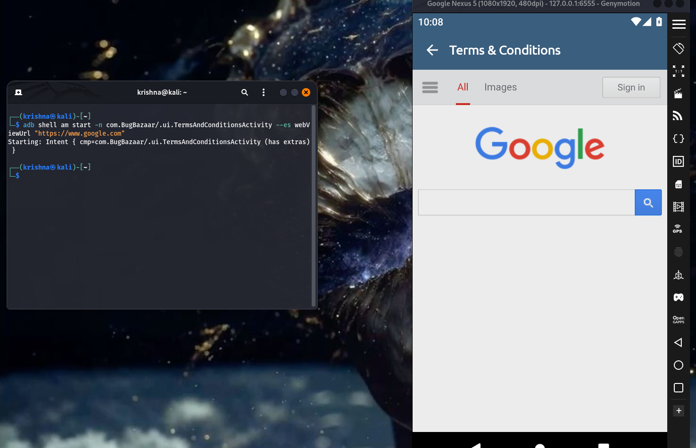

Opening arbitrary URLs in the WebView is a critical WebView vulnerability that arises when an app allows WebView to load content from untrusted or external sources without proper validation. This opens the door for attackers to embed malicious scripts or phishing pages, putting user data and app security at risk. For example, an attacker could trick the WebView into loading a fake login page to steal user credentials.

this above ss says that its using internet and loading [payatu.com](http://payatu.com) webiste

since the url should load somewhere to show output so searched for loadurl beacuse thats the entry point ,in global search and found it in Terms & conditions activity 

here we can see javascript is enabled to true and allow universal file access to true 

adb shell am start -n com.BugBazaar/.ui.TermsAndConditionsActivity --es webViewUrl "[https://www.google.com](https://www.google.com/)"