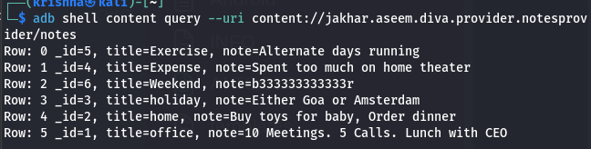

So content provider acts as medium between apps query and data base it creates a copy of the data base instead of redirecting into main data base
<empty-block/>
the content provider uses uri (uniform resource identifier) to take us to right place in the data base if the content provider doesnt have a proper protection such as enabling exported = true, someone else can get access to data base if he knows the correct uri
<empty-block/>
finding the uri 
after understanding the code in jadx we will find that if we enter the pin in AccessControl3Activity we will go to AccessControl3NotesActivity for checking the password and the load the notes from NotesProvider 
In the NotesProvider class we can find the content uri  
so we can use adb and the content provider uri to get the info directly using the command 
adb shell content query --uri content://jakhar.aseem.diva.provider.notesprovider/notes

and the basic command is `adb shell content://<AUTHORITY>/<PATH>` 
Extra flags 
\[--user \<USER_ID\>\]\[--projection \<PROJECTION\>\]\[--where \<WHERE\>\]\[--sort \<SORT_ORDER\>\]
<empty-block/>
if i am the developer i would solve this by changing the code in android manifest xml setting android exported to false not allowing other apps or devices to get access of db in the provider tag
<empty-block/>