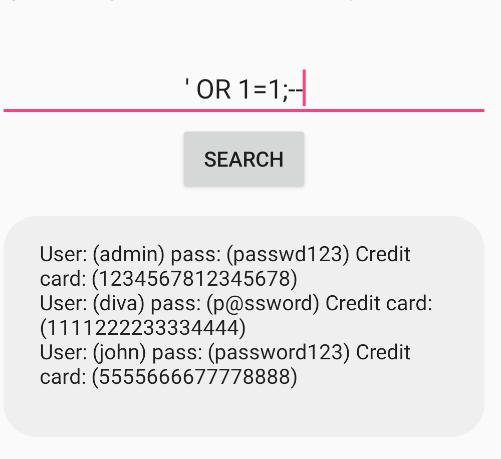

In the jadx there is no activity called input validation issues part1 as there it is for part 2 and 3 so i used the command `adb shell dumpsys window | grep mCurrentFocus` to know which activity is currently being active on the screen and receiving touch and text inputs and found its sql injection activity
<empty-block/>
so we have to use sql injection for this challenge so i found the query is send to the data base of the table sqliuser `Cursor cr = this.mDB.rawQuery("SELECT * FROM sqliuser WHERE user = '" + srchtxt.getText().toString() + "'", null);`
<empty-block/>
so here the query starts from  "SELECT \* FROM sqliuser WHERE user = '   " + srchtxt.getText().toString() + "  '  ", null
the query starts with a double quote and it searches for the string which is represented in double quotes and it returns the everything in the data base about that string
<empty-block/>
now we have to make the app to return everything in logs so we have to make a request that makes it true for the data base so it returns the total table
the sql command is choose is ‘ OR 1=1;-- 
we can even use any other true statement
refered [SQL Injection Cheat Sheet - GeeksforGeeks](https://www.geeksforgeeks.org/ethical-hacking/sql-injection-cheat-sheet/)
and found the basic commands fo sql injection so we have to first close the single quote **‘  **then we are giving an expression which is 1=1 which is always true and sends true to data base so by giving that we can get the total users info in log message 

I would remove this line which exposes db if the query is true `Toast.makeText(this, strb.toString(), 0).show();`
Instead of builder string, you use a `?` placeholder. The database engine then treats your input strictly as "data" and never as "executable code."